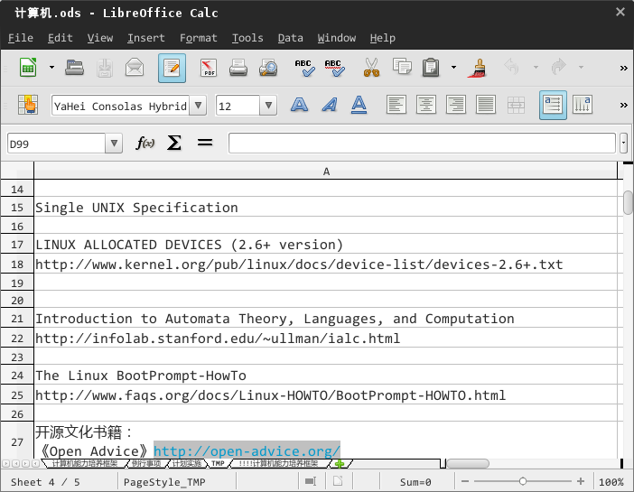
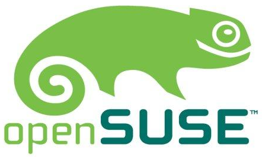

美丽新世界：linux 下的惬意生活
================
---------------
yangyang.gnu@gmail.com  
2014-9-25 15:45:04   

<!--##公告-->
<!--**捐赠：如果觉得本文有用，可以考虑捐赠点碎银，支付宝 yangyang.gnu@gmail.com，不好意思 $\_$**-->

<!--**讨论**：任何意见建议移步 http://www.v2ex.com/t/123175  -->

<!---->

linux，从深海潜艇到高空侦察机、从房间大的工作站到手掌小的手机、从远至美国的 google 服务器到近在客厅的机顶盒，你都能见到它的身影。我无意说服你抛弃娴熟使用的操作系统转投 linux，假如你崇尚自由、渴求本质、热爱折腾，不妨一试！

##0、发行套件
linux 本身还算不上完整的操作系统，它仅是个内核（一方面管理协调下层的硬件资源，一方面为上层软件提供基础服务支撑），需搭配系统软件（shell、编译器、包管理器、桌面环境等等）、应用软件（办公软件、网页浏览器、音视播放器、图片编辑器等等）才能成为一套具备日常使用功能的操作系统，即，发行套件。

###0.1 发行套件的选择
linux 的发行套件多达 140+，但本质上大同小异，选定 kernel、包管理器、桌面环境、shell 后在系统层面就基本定型了，再按不同用途选定对应应用软件那么应用层面也就有了，最后就形成了各类发行套件，比如，盲人的 vinux、教育培训的 ubermix、家庭影院的 OpenELEC、安全渗透的 kali、国人专供的 deepin。所以，基本上，你不要在发行套件的选择上消耗精力，目前的主流发行套件包括：slackware、debian、fedora、arch、gentoo、ubuntu、lfs、openSUSE 等，它们各具特色、追随者众，比如，slackware 是目前存活时间最长古董级的发行套件（经验丰富），fedora 是 redhat 进行新技术实验的发行套件（技术创新），ubuntu 号称零配置开箱即用的发行套件（简单易用）、LFS（linux from scratch）让你从无到有构建个人专属的发行套件（配置灵活）、经验丰富+技术创新+简单易用+配置灵活 = openSUSE！所以，我向你推荐它。

openSUSE 最早是 slackware 在德国的本地化版本，后来因其加入了大量特色功能升格为单独的发行套件，其原名为 suse linux，10.2 版开始更名为 openSUSE。openSUSE 由 novell 公司赞助、社区推动的发行套件，它的相关源码和技术可由 novell 使用，作为 novell 企业版发行套件 SLES 的基础。openSUSE 旨在：a）推进 linux 在全球广泛使用；b）降低 linux 使用门槛，成为易于上手的发行套件；c）成为技术黑客和软件开发人员的首选平台。openSUSE 的 logo 是只可爱的变色龙，以此象征 openSUSE 灵活、敏捷的特性。当然，本文并不局限 openSUSE，适用于任何发行套件。

  
(logo)

另外，关于发行套件的版本更替，通常我会在最新正式版放出半年后再考虑，原因有二：一方面经过半年的大规模外部用户测试，大量 bug 已被发现并修正，一定程度上规避了使用系统的不稳定性；一方面各类应用软件开发人员有足够时间针对新版本的发行套件进行功能升级和兼容性优化，让我真真正正感受到新版本带来的各项提升。

0.2 发行套件的安装
    既然是普通用户使用的发行套件，势必集成了某种桌面环境以便用户通过可视化界面操作计算机（底层由 x.org 提供图形图像服务，中间由桌面环境负责统一管理各应用软件发起的图形绘制请求并协调 x.org 予以响应）。基本上，各类发行套件都提供 gnome 和 kde 两种桌面环境供君选择（此外，还有 xfce、lxde、ede、rox 等等其他桌面环境可单独下载安装）。gnome 是隶属 GNU 项目群的子项目，全称为 the gnu network object model environment，采用 GTK（由 C 语言编写）作为底层开发库；KDE 全称 kool desktop environment，采用 QT（由 C++ 语言编写）作为底层开发库。gnome 和 kde 是 linux 中最为流行的桌面环境，从操作习惯和界面风格来看，我更喜欢 gnome。
    安装发行套件包括如下几步：
    第一步，下载镜像。选择桌面环境（gnome 或 kde）、系统构架（32 位或 64 位）；
    第二步，制作安装 U 盘。U 盘安装既节省光盘介质费用，又能大幅提升安装速度，逐渐成为你安装系统的首选。借由 imagewriter 制作启动盘；
    第三步，安装系统。整个过程一路 next，除了时区选用 UTC、分区大小两个关键点稍加留意外，基本零难度。建议依次创建如下分区：/、swap、/home、/data。几点说明：
    0）linux 的分区不同于 windows，分区后没有所谓的 C:、D: 盘，而是一个个文件系统，这些文件系统没有具体名称，必须先挂载到某个目录（称之为挂载点）下才能正常使用，分区与目录一一对应；
    1）操作系统为扩展物理内存容量通常设有“虚拟内存”机制，将不活波内存页（如，未关闭但长时间没使用的程序）从物理内存移至硬盘的虚拟内存，从而释放宝贵的物理内存空间，swap 分区就是所谓的虚拟内存，一般将其容量规划得等同于物理内存即可，但，只有在物理内存吃紧时（如，启用多个大型程序、运行了存在严重泄漏的程序）系统才会使用 swap，换言之，如果你机器物理内存较大（如，8G），也不一定非要将 swap 分区划为与物理内存一样大，给个 2G 让系统应个急即可。另外，由于不存在由用户直接发起的swap分区读写的场景，所以该分区不用挂载目录，由系统自行管理。如果想查看 swap 实时使用情况，可执行“vmstat 1”命令，输出信息中，si 表示 1 秒内写入 sawp 的内存页大小，so 从 swap 中读出的内存页大小，单位为 K；
（查看swap使用情况）
    2）用户相关信息（如，应用程序的配置文件）通常放在 /home 目录中，为避免重装系统导致各类配置文件丢失，需将 /home 放在独立分区上。应用程序配置文件通常位于如下路径：~/.[app_name]、~/.config/、~/.local/share/、~/.local/share/applications/、/etc/[app_name].conf，若发现程序运行异常，可先删除相关配置文件再试试；
    3）所有非系统数据（如，歌曲、ebook、安装程序）都放在独立分区 /data 上，以便定期备份。

0.3 发行套件的设置
    刚装好的操作系统都是默认设置，按个人习惯适当调整才贴心。

0.3.1 升级系统
    linux 上系统升级分两部分，一部分是内核升级，一部分是发行套件升级（即，除内核外的驱动程序、系统软件、应用软件等升级）。

预编译内核选择
    升级内核是为了享受新内核带来的安全增强、更多设备支持、以及各类新特性，有两种可选方式：方式一，如果熟悉内核编译选项，那么你完全可以针对自己的设备编译出最大程度发挥设备性能的定制版内核，另文详讲；方式二，如果不具备这些知识，也别急，openSUSE提供了几种常见场景的预编译内核，在软件仓库中选择中意的版本，安装、重启即可。常见的预编译内核包括：
kernel-default 是系统默认版内核，这是保守选择，能保证在所有设备上成功启用操作系统；
kernel-pae 在 kernel-default 基础上增加了“物理地址扩增”功能，支持识别大于3G的物理内存设备（最多支持至 64G）；
kernel-desktop 在 kernel-pae 基础上针对桌面进行优化，并屏蔽了只有服务器上才会使用的内核功能；
kernel-syms 含有内核源码符号，如变量名、函数名、结构名，便于内核跟踪调试；
kernel-vanilla 是纯净版内核，清除了发行套件自行添加的补丁。
默认安装的是 kernel-default，无法使用大于 2G 的内存、未进行桌面优化，通常来说，你应改用 kernel-desktop。
    安装新内核，执行
zypper in kernel-desktop
这时，你系统中将存在两个内核，kernel-default 和 kernel-desktop，如果系统中存在了多个可用到内核，那就需要有个地方去记录、管理内核列表 —— /boot/grub2/grub.cfg，该文件中存放了不同版本内核列表，大概结构如下：
### BEGIN /etc/grub.d/10_linux ### 
menuentry 'openSUSE 12.2' …
{
	...AAA...
}
submenu 'Advanced options for openSUSE 12.2' …
{
	menuentry 'openSUSE 12.2, with linux 3.4.11-2.16-default' …
	{
		...
	}
	menuentry 'openSUSE 12.2, with linux 3.4.11-2.16-desktop' …
	{
		...BBB...
	}
}
假定希望选用 kernel-desktop 版内核，那么将 openSUSE 12.2, with linux 3.4.11-2.16-desktop 后花括弧内容全部拷贝覆盖至 openSUSE 12.2 花括弧内，调整后该文档结构大致如下：
### BEGIN /etc/grub.d/10_linux ### 
menuentry 'openSUSE 12.2' …
{
	...BBB...
}
submenu 'Advanced options for openSUSE 12.2' …
{
	menuentry 'openSUSE 12.2, with linux 3.4.11-2.16-default' …
	{
		...
	}
	menuentry 'openSUSE 12.2, with linux 3.4.11-2.16-desktop' …
	{
		...BBB...
	}
}
重启，下次系统将默认选用 kernel-desktop 版内核。登录系统后执行
uname -r
可查看当前使用的内核版本，执行
less /proc/meminfo
可查看系统识别的物理内存（输出第一行 MemTotal 字段中显示）。

发行套件升级
    在进行发行套件升级前，先说说软件仓库。前面说过，发行套件是集成内核、驱动程序、系统软件、应用程序等一整套可支撑普通用户日常工作、生活需求的操作系统，可见，发行套件充当了软件筛选、软件打包、软件依赖库测试、软件兼容性测试等多个角色，为确保发行套件的健壮性，发行套件厂商（或社区）将它筛选、打包、测试过的软件放在官方软件仓库中，这样，不论哪个厂商开发的应用程序，用户只需到软件仓库中查找、下载、安装即可，不用（像 windows）再到各个软件官网逐一下载，当然，软件仓库中没有的，你仍可到软件官网单独下载，但要注意依赖库是否正确。软件仓库一般放在发行套件官方服务器上，用户通过更新源访问软件仓库。因此，更新源就是软件仓库的路牌。好了，了解了软件仓库、更新源等概念后，我们可以按如下步骤升级发行套件啦。
    第一步，添加更新源。更新源的选择一定要严谨，尽量选择针对你使用的特定发行套件（甚至版本）且经过严格兼容性测试的源，这些更新源中收录的软件可能不是最新的但一定是最稳定的。基于这一思想，除了开启发行套件自带的几个默认官网更新源外，我增加了社区制作的各类更新源。这是大而全的更新源合辑，你需要的 99% 软件均可在此找到，其中，包括了两个重要源，一是 nvidia 显卡驱动源、一是 packman 第三方源（收录了大量经过严格测试的新软件）。具体操作，选择 community repositories，勾选所有源后保存即可。此外，社区源之外还有个 M17N 源，它大量收录了软件国际化、本地化等相关库文件，在让你品尝新功能以及满足本地化需求的同时，可能会引入系统稳定性和软件兼容性问题，请谨慎添加，http://download.openSUSE.org/repositories/M17N/openSUSE_13.1
    添加完更新源后，我们还应注意几点：一、软件安装完成后自动删除安装程序，以节约存储空间，在 software repositories 中取消每个更新源的 keep downloaded packages；二、不同更新源中难免有重复的软件，这时，必须有个机制指示系统选用哪个源中版本——更新源优先级，优先级从 1 到 200，数字越小优先级越高，系统优选优先级高的更新源中的软件，通常来说，收录的软件测试周期越长、测试越严格的更新源应第一优先，即，http://download.openSUSE.org/update/13.1/ 的优先级应置为 1。
    另外，如果你的网络环境无法流畅访问境外官网软件仓库，可以转为访问其在朝内镜像。国内还有几家上规模又有良心的 IT 企业，通过企业自身带宽优势，准实时地从发行套件官网同步软件仓库到国内服务器上，冏朝用户可调整更新源，实现从这些企业的服务器上高速访问软件仓库。目前，为各大发行套件建立国内软件仓库镜像的企业有搜狐、东软，高校有北京交大、中国科大、中央音乐学院（歌唱艺术家也玩 linux ^…^），开源社区有 LUPA 等，以上机构均为 openSUSE.org 官方注册镜像，具体镜像地址参见 http://mirrors.openSUSE.org；
    第二步，删除无用软件。系统默认安装的软件不见得都是你需要的（如，gnome 自带小游戏、某些软件自带的非中文和英文的帮助文档），进 install/remove software，取消待删除软件前的勾选框，apply 即可。
    第三步，升级系统。一旦指示系统启动升级，系统先在软件仓库（加载的所有更新源）中寻找是否有升级的可能。具体而言，存在三类升级方式：
    第一种，命令 zypper update。对于本地已安装程序，如果软件仓库中有新版本，新老版本来至同个更新源，并且新老版软件构架相同（如 X86_64、i686、noarch 等等），那么才会执行软件升级操作，否则，即便源中存在新版，系统会提示类似如下信息 The following package updates will NOT be installed: chmsee，以告知 chmsee 虽有新版本但系统不会为你更新。换言之，update 是个非常保守的选项，即便软件仓库中有新版本，该命令也不一定让你得到新版软件。当然，如果你非要安装，也可以先执行 zypper install chmsee 命令，但此时系统还不会真正升级软件，而是反馈你最新版本号为 1.99.08-32.3.i586，若你确定要升级必须执行 zypper install chmsee-1.99.08-32.3.i586；
    第二种，命令 zypper patch。为系统打补丁，这是提升系统安全性的重要一环，怒建阁下日常定期执行；
    第三种，命令 zypper dist-upgrade。将系统与软件仓库同步一致，也就是说，本地安装的软件必须与仓库中的绝对一致，换言之，一旦执行该命令，本地软件将存在软件降级（本地版本高而仓库版本低）、软件升级（本地版本低而仓库版本高）、卸载软件（本地安装而仓库没有）、安装软件（系统认为有用，也就是 zypper install-new-recommends 命令输出信息中罗列的软件）等几种可能，特别是当你有通过源码安装过软件时切勿使用该命令。
    总之，以上三个命令差异巨大，就日常而言，建议：用 zypper patch 为系统打补丁，用 zypper update 升级系统，用 zypper install program_version_num 升级 zypper update 无法升级的软件；

0.3.2 安装驱动
    windows 下新增硬件外设，通常需要到硬件官网下载驱动，安装重启后系统才能识别新增硬件设备，linux 对驱动的管理，你可以（片面地）理解为全都打包进内核中了，只要是内核版本足够新（这正是前面升级内核的目的之一），99% 的硬件完全可以识别，换言之，你不用针对主板、芯片、网卡、显卡、声卡单独下载安装驱动，因为内核已经集成了它们的驱动，当然，我指的是集成驱动能很好地管理对应硬件设备，如果管理得不是那么好呢？那也可以单独安装，比如，显卡驱动。
    我用的 N 卡，以此为例。openSUSE 预置了 N 卡驱动程序的开源版 nouveau，nouveau 由第三方开发，并未得到 nvidia 官方支持，是开发人员对 N 卡官方驱动逆向分析后的重新编码，实现难度巨大，虽效果不尽人意但也值得你尊重。作为普通用户，肯定希望最大程度发挥显卡特性，可以考虑安装 N 卡针对 openSUSE 发布的（闭源）官方显卡驱动吧。先增加 N 卡官方更新源 ftp://download.nvidia.com/openSUSE/13.1，再执行前面讲的升级命令即可。
    最新的 nvidia 驱动（v340）存在严重 bug，会出现屏幕闪烁、撕裂现象，在官方修正前，你可以禁用 clipped-redraws 和  culling 两个显卡特性来临时解决，具体可在 /etc/environment 配置文件中添加
CLUTTER_PAINT=disable-clipped-redraws:disable-culling
CLUTTER_VBLANK=True

0.3.3 美化桌面
    前面提过，我选装的是 gnome 桌面环境。gnome3 相较先前版本，不论从界面外观还是操作习惯都有非常大的差异，比如，窗口右上角只有关闭按钮，不再有最大化、最小化的概念；比如，托盘从任务栏中剥离出来，默认情况下为隐藏状态；比如，要选择桌面上的某个窗口，先得调出所有窗口的列表，在点击选择需要的那个；比如，不再有桌面图标，等等。如此这些，让很多人无法适应、被人诟病。也许是心态问题，我倒是挺适应这种操作模式的，使用 gnome3 也有几年时间了，虽谈不上驾轻就熟，但也不存在任何使用障碍，非要让我提一点意见的话，嗯～嗯～，好吧，真心希望 gnome 开发团队将横向布局的任务栏改为纵向布局，至于原因，你知道，如今的显示器几乎都是宽屏的，这就意味着屏幕的水平空间充裕而垂直空间紧张，现在又将任务栏水平放置在最顶部，进一步缩小了可用垂直空间，所以，强烈建议将任务栏垂直放置在屏幕左侧（效果类似 ubuntu 的 unity），希望下一版本能有所改善。另外，个人认为，对于一项新生事物（我说的是 gnome3），不妨以“拥抱变化、迎接未来”的心态去尝试，或许，你会发现，原来它才是你的最爱。
    扯远了，接着说 gnome 的美化。桌面美化，无非就是选一套符合你审美观的主题，具体包括窗口主题、图标主题、光标主题、图形环境登录界面、系统声音等等，下载、安装、启用即可。
    第一步，预准备。主题安装不像想的那么容易，为确保不同发行套件下均能安装成功，请提前作好如下准备：
安装时机：主题应尽量在安装完所有软件后再安装，否则可能出现部分软件与当前主题无法适配的情况；
各版本 GTK 库：GTK、GTK2、GTK3 等三个版本等基础库必须事前安装；
主题引擎：murrine、unico、adwaita、canvas、pixbuf 等几类主题引擎必须安装。若安装主题后仍存在滚动条粗大、按钮错位等情况，再把 gtk2-engine-*、gtk3-engine-* 安装上；
安装路径。一般而言，主题文件和图标分别放至全局目录 /usr/share/themes/ 和 /usr/share/icons/，或者分别放至账号目录 ~/.themes 和 ~/.icons 均可。建议优选全局目录，账号目录有一定几率导致主题失效；
    第二步，下载主题。推荐两个 gnome3 相关的主题网站：http://gnome-look.org 与 http://linux-lounge.deviantart.com，慢慢选，喜欢哪个下哪个。个人非常喜欢那种扁、平、薄的风格，GTK 主题选用 Numix-Solarized（https://github.com/HuiJun/Numix-Solarized），搭配 faenza 图标主题（http://tiheum.deviantart.com/art/Faenza-Icons-173323228）效果非常不错。
    第三步，安装主题。将相关主题拷贝至 /usr/share/themes/ 和 /usr/share/icons/ 目录即可。具体而言，GTK 主题 Numix 解压后的 Numix/、Numix - GTK3.4/ 目录拷贝至 /usr/share/themes/，faenza 图标主题解压后得到压缩文件 Faenza.tar.gz、Faenza-Dark.tar.gz、Faenza-Darker.tar.gz、Faenza-Darkest.tar.gz 分别再解压后得到 Faenza、Faenza-Dark、Faenza-Darker、Faenza-Darkest 等四个目录拷贝至 /usr/share/icons/ 目录。注意，a）如果无法选择对应主题，请确认是否多套了一层目录；b）/usr/share/themes/ 和 /usr/share/icons/ 目录中系统自带主题和图标切勿删除，否则将导致无法登录图像界面；
    第四步，选择主题。运行 tweak tool，参照下图选择窗口和图标主题：

（选择主题）
    第五步，启用主题。键入 alt+f2，输入 r 回车，看到没，刚才选择的主题已经生效。最终效果如下：
（gnome3-holo）
    第六步，字体美化。openSUSE 中文显示默认采用文泉驿字体，相比之下，更喜欢微软雅黑那种方方正正的饱满字体，但微软雅黑中的英文字体又不咋地，有人发布了一款增强了英文字体的微软雅黑——yahei consolas hybrid 字体，可以下来试试，效果非常不错（本文全文采用的就是这种字体）。双击字体按提示安装，安装完后进入 advanced settings，按如下设置即可：
（字体设置）
    第七步，动态壁纸。GNOME3改变了很多传统用户习惯，淡化桌面概念就算之一，默认不再有桌面图标、无法将窗口最小化到任务栏、没有返回桌面按钮，99% 时间你看到的是某个应用程序的全屏窗口，体现了“内容至上”的理念，正因为此，GNOME3 中不再有动态壁纸功能，用户只有 1% 的时间可能看到桌面墙纸，动态壁纸功能理当下线——GNOME3 设计人员托梦告诉我滴 ~_~。如果你仍然迷恋动态壁纸，可以通过如下方式实现：
    首先实现基础功能。将如下 shell 代码拷贝至 auto_wallpaper.sh 文件，其中，两处的 /data/misc/software/misc./gnome3/wallpaper/ 替换为你存放图片的目录，4096 替换成你希望间隔多少秒自动切换一次墙纸（why 4096? that is 2^12, and that is 68m :-）
#!/bin/bash 
cd /data/misc/software/misc./gnome3/wallpaper/ 
while [ 1 ] 
  do 
  set - * 
  length=$# 
  random_num=$(( $RANDOM % ($length + 1) )) 
  gsettings set org.gnome.desktop.background picture-uri "file:/data/misc/software/misc./gnome3/wallpaper/${!random_num}" 
  sleep 4096	# 68分钟变化一次桌面墙纸 
done
    然后实现停止动态壁纸。先找到 auto_wallpaper.sh 脚本的进程 ID（严格地说，应该是启动该脚本的父 shell 进程 ID）：
linux-asze:~ # ps -ef | grep auto_wallpaper 
root 3027 1 0 16:58 ? 00:00:00 /usr/bin/gnome-terminal -x /bin/sh -c '/data/misc/software/misc./gnome3/wallpaper/auto_wallpaper.sh'
直接杀掉该脚本：
kill -9 3027
    最后实现自动启动。将如下代码拷贝至 auto_wallpaper.desktop，并将该文件移至 ~/.config/autostart/ 目录。其中，/data/misc/software/misc./gnome3/wallpaper/auto_wallpaper.sh 替换为上面保存的 auto_wallpaper.sh 文件多绝对路径：
[Desktop Entry] 
Name=auto_wallpaper 
Exec=/data/misc/software/misc./gnome3/wallpaper/auto_wallpaper.sh 
Comment=change wallpaper every so often 
Hidden=false 
Type=Application 
X-GNOME-Autostart-enabled=true
    说了这么多，作为普通用户，我们关注的还是 openSUSE 如何支撑我们的日常工作、生活需求。接下来看看，那些借助社区力量开发的优秀开源产品。（注，未特别说明，以下介绍的软件均可通过软件仓库查找、下载、安装）
    如果你需要的软件在添加的各类软件仓库中都无法找到，可依次尝试如下两个专用搜索引擎：http://software.openSUSE.org/search 和 http://www.rpmfind.net，若还是无法找到，只有借助通用搜索引擎找到该软件官网，再下载安装。

0.3.4 其他设置
    某些软件在界面上未提供用于设置的 preferences 菜单项（如 gedit、 nautilus），这时只有请出 dconf-editor。windows 的很多底层设置可以在注册表中进行，linux 对应可以在 DBUS 中设置，dconf-editor 就是 DBUS 的图形界面编辑器。dconf-editor 管理的设置很多，大家可以自己琢磨玩玩，如下几类我建议你考虑：
gedit 取消自动备份： org - gnome - gedit - preferences - editor，取消 create-backup-copy ；
清空回收站时无须再次确认：org - gnome - nautilus - preferences，取消 confirm-trash；
文件管理器顶部显示当前路径：org - gnome - nautilus - preferences，勾选 always use location entry；
文件管理器 nautilus 以详情列表模式罗列文件列表：org - gnome - nautilus - preferences，default-floder-viewer 选择 list-view；
文件列表以小图标且显示 ：org - gnome - nautilus - list_view，default-zoom-level 设置为 smallest；
文件列表以树形目录显示 ：org - gnome - nautilus - list_view，勾选 use-tree-view。

1 日常办公
    现在的企事业单位几乎都需借助电脑办公，医生看病开处方、营业厅办理业务、会计帐务处理等等，电脑已成为各行各业办公的主要途径和手段。下面介绍几类常见的办公需求。

1.1 办公文书
    word、excel、powerpoint 等三个软件是 windows 中必装的办公文书软件，以支撑我们文字处理、表格制作、汇报演示等工作需要。linux 中我们对应有writer、calc、impress 等软件，这三个软件（外加 draw、math、base）就是大名鼎鼎的 libreoffice 套件。libreoffice 完全兼容 ms-office 文档，甚至还可以直接转存为 pdf 格式文件，
    软件名称：libreoffice
    界面截图：
（writer）
（calc）
（impress）
    设置调整：tools -> options -> language settings -> writing aids，取消 options 中的所有选项，以禁止拼写检查。

1.2 电邮收发
    很多人喜欢通过邮件服务提供商官网进行邮件收发，强烈建议改用邮件客户端，避免频繁登录邮箱，同时，还能离线查阅邮件内容。好的邮件客户端除了正常收发邮件外，还应具备地址簿管理、垃圾邮件过滤、多账户管理、日程安排、同步删除远程邮件，甚至为常见邮件提供商智能配置等等高级功能，thunderbird 算是不错的。
    软件名称：thunderbird
    界面截图：
（thunderbird）
（写邮件）

1.3 电子书阅读
    电子书格式类型较多，包括 hlp、lit、wdl、ceb、abm、pdg、epub、pdf、chm 等等，但常见的还是最后两类。下面介绍下 pdf 和 chm 的阅读器。

1.3.1 pdf 阅读
    世上有三件事你无法回避：死亡、税收、阅读 PDF 文档。
    软件名称：evince
    界面截图：
（evince）
    使用问题：你知道，正常情况下，被选中的文本段会反色高亮显示，估计是 evince 本地化问题（未用 unicode 编码 -_-??），某些中文 pdf 文档，反色显示的文字会成乱码，虽不影响真正复制到粘贴板中的内容（换言之，从 evince 中复制出来的文字仍正常），但一定程度上影响了我等喜欢选中一段看一段的用户阅读体验。如下图所示：
（未选前的文本）
（选中后的文本）
    其他说明：推荐几个常用的软件开发相关电子书下载网站：http://it-ebooks.info、http://www.freetechbooks.com。
    另外，我对 pdf 修改也有使用需求。很遗憾，linux 下并无稳定、高质量的 pdf 修改开源工具，上古时代的 pdftk、flpsed、pdfedit 一众古董完全派不上场，pdf studio 算是唯一功能达标的，但又是闭源共享软件，不推荐。既然修改不了 pdf，添加注释总可以吧，xournal 就是满足这一需求的软件。
    软件名称：xournal
    界面截图：
（PDF修改）

1.3.2 chm 阅读
    虽然 chm 文档越来越少，但难免还是会遇到，有两个工具可阅读 chm：chmsee 和 kchmviewer。
    软件名称：chmsee；
    界面截图：
（chmsee）

2 娱乐休闲
    linux 不是 IT 大牛的专属系统，它不仅可以支撑生产运维，同时，也可为你提供日常休闲娱乐。

2.1 歌曲聆听
    常见的音频格式包括：mp3、ogg、aac、mp4、ape、wav、flac 等，windows 下知名的音频播放器 foobar2000 完美支持这些格式，linux 下的 deadbeef 从解码效果来看，有过之而无不及。
    软件名称：deadbeef
    界面截图：
（deadbeef）
    设置调整：无；
    使用问题：
一般来说，通过软件仓库安装某个软件，系统会自动关联安装依赖库，以保障软件正常运行，但，deadbeef 依赖的必要插件 deadbeef-restricted-plugins 并未自动关联，需手工自行添加，否则 deadbeef 无法加载歌曲；
要让当前播放曲目显示在播放列表窗口中可以：ctrl-j 快捷键，或者，菜单中选择playback -> scroll follows playback；

2.2 电影观赏
    我看电影有个习惯，喜欢把电影全屏铺满后再看，这样不至于在如今满是宽屏幕的环境中把人物压缩得又扁又胖。另外，针对视频文件名类似的多个文件要能连续播放（也就是连续自动播放连续剧）。linux 下找了一圈都没发现满意的，包括大名鼎鼎的 vcl 和mplayer，直到有天我遇到 umplayer。umplayer 是基于 mplayer 二次开发的软件，默认支持（即内置相关格式解码器） mkv、wmv、avi、mpg、3gp、mov、rm、mpeg、mp4 等视频格式。
    软件名称：umplayer
    界面截图：
（普通比例）
（全屏铺满）
    设置调整：全屏铺满设置：video -> aspect ratio -> disabled；
    使用问题：全屏纵向拉伸设置只能针对单部影片有效，无法保持为永久设置，播放其他影片需要重新设置；
    其他说明：推荐两个不错的电影下载网站：人人影视（http://www.yyets.com）和电影天堂（http://www.dy2018.com）

2.3 音频编辑
    听到一首喜欢的歌曲，想把它设置为手机来电铃声，但整首歌曲又太长，最好能把高潮部分提取出来，一来电就进入高潮（-_-$，你想啥～）。
    软件名称：audacity；
    界面截图：
（audacity）

3 网上冲浪 
    问：宅男最怕失去啥？答：网络（谁说苍老师？@_@！）。网络在给我们带来无限乐趣的同时，也在不断地改变着人类生活方式。

3.1 网页浏览
    浏览器是互联网入口，各大互联网公司必争之地。opera、chrome、firefox 三大浏览器，opera 功能上没有多少过人之处且不开源，丢之；chrome 虽有开源版本 chromium，但很多插件都仅支持 windows 平台而在 linux 下无法使用（包括google自己出品的 Chrome Toolbox），弃之；firefox，开源且以 linux 为第一阵营，凭借其高安全性和可扩充性赢得大量忠实用户。
    软件名称：firefox；
    界面截图：
（firefox）
    你对 firefox 的任何需求，几乎都可以通过其丰富的插件资源得到满足（另一个有如此庞大插件资源的软件当数 vim 了，后面有介绍）。进入 tools -> add-ons 即可在线查找需要的插件，找到后点击在线安装即可，安装完成需重启浏览器以让新装插件生效。下面介绍几款我觉得非常有用的插件。
    下载管理，download status bar。完全替代 firefox 自带的下载管理器，它可以实时查看下载进度、可以直接打开下载完的文件、可以根据当前下载速度用不同颜色高亮提示等等。如下图，第一个文件已下载完毕，第二个正在下载，实时速度为 167.2K、下载进度为 19%、橙色背景表示速度在 200K 以下，若达到 600K 则会显示为绿色：
（download statusbar）
    对象拖拽，quickdrag。若拖拽链接则直接打开，若拖动文本则在当前搜索引擎中搜索。如下图所示：
（对象拖拽插件 quickdrag）
另外，我不太喜欢立即激活新页面，本来 firefox 中有个选项（preferences -> tabs -> when I open a link in a new tab, switch to it immediately）可用于此设置，但长年无效，只能直接修改它的配置项：地址栏中输入 about:config，查找 browser.tabs.loadDivertedInBackground 配置项，双击使其为 true 即可。
    鼠标手势，all-in-one gestures。我常用的右键向左拖动表示退回、向右拖动表示前进。如下所示：
（鼠标手势插件 all-in-one gestures）
    双击关闭 tab，close tab by double click。无须多说，个人习惯；
    侧边显示，all-in-one sidebar。将收藏夹、下载管理、插件管理、访问历史等统一收纳到侧边条中，如下图所示：
（侧边显示插件 all-in-one sidebar）
    恢复关闭页面，Undo Closed Tabs Button。下载安装好后，先要通过 customize 将 undo 图标拖动到 firefox 工具栏中才能看到。如下图所示：
（恢复关闭页面插件 Undo Closed Tabs Button）
    flash 播放。目前几乎所有在线视频、在线文库等网站都通过 flash 实现（亲，我说的通过浏览器直接访问，我知道你 iphone 也可以观看在线视频，但那是通过安装本地APP 观看，与这儿说的事情没啥干系），常逛这类网站的朋友必须得装 flash 插件才能正常访问。adobe 不给力，导致很多浏览器加载 flash 文件时失败，提示 the adobe flash plugin has crashed：
（flash插件报错）
    到 adobe 官网 http://get.adobe.com/flashplayer/otherversions/ 下载最新版的 *.tar.gz，解压后提取 libflashplayer.so 至 /usr/lib/browser-plugins/libflashplayer.so，重启 firefox 即可正常显示 flash。
    另外，如果你用的是 chromium 则不太可能出现 flash 显示问题。这是因为 google 与 adobe 合作开发了一项称之为 pepper API 的新技术，google 自家的 chromium 肯定支持 pepper，这就使得 flash 可以以插件的形式运行在 chromium 浏览器中。包括 firefox 在内的其它浏览器则不支持这项技术，因此也就无法播放 flash。
    听闻 adobe 公告，从 11.2 以后不再支持 linux 平台，唉，乔帮主英明，adobe 要自掘坟墓咱也别拦他，全当在给 HTML5 腾位置吧。
    在线视频下载，1-Click YouTube Video Download。随着在线视频的繁荣，国外的 YouTube、国内的 PPTV 等一大批视频网站上沉淀了很多有价值的视频，考虑到天朝宽带排名全球 96 位的现状，为了不影响观影体验，我有很强的驱动力将在线视频下载到本地。
    YouTube 上的视频，可由插件 1-Click YouTube Video Download 实现下载。安装好该插件重启 firefox 后，进入某个具体视频页面，在视频左下角多了个 Download 按钮，点击该按钮你将看到不同分辨率的视频下载地址列表，见下图：
（YouTube 在线视频下载插件 1-Click YouTube Video Download）
    此外，国外 vimeo、metacafe、intv 甚至 facebook 等等网站上的视频，我推荐你使用在线工具 http://en.savefrom.net/ 解析视频地址；国内的 PPTV、优酷、土豆、奇艺等等视频网站，可以通过硕鼠 http://www.flvcd.com 解析。
    添加搜索引擎，Add to Search Bar。互联网是个巨大的知识库，你需要的任何知识都可以从中获取，前提是有个给力的搜索引擎。在我看来，好的搜索引擎应该：检索范围广泛、收录页面快速、检索结果无屏蔽、原创内容优先、智能分析相似关键字。
    搜索引擎如何选择？根据搜索内容的不同，我会依次使用如下几个引擎进行查找：
英文资料，先 http://www.duckduckgo.com 后 http://www.google.com，前者剔重算法完胜后者，而且搜索过的关键字绝对不记入 cookie。（从大陆发起的访问自动被转向到香港服务器 http://www.google.com.hk，要访问美国服务器可用如下网址 http://www.google.com/ncr，其中，ncr 为 no country redirect，即不根据访问请求发起国家进行重定向）；
中文技术资料，先 http://tw.search.yahoo.com 后 http://www.google.com.tw（百毒？没听过 ^o^）；
    啰嗦几句，台湾人的技术文章多以原创为主，不像冏朝清一色的转载，特别是，很多国外经典计算机书籍引入冏朝后，被所谓的大学教授翻译得比日文还难读（《thinking in c++》，多经典的一本书，翻译得老子想骂人），这时，可以考虑找对应台译版（台版《thinking in c++》由蔡明志先生翻译），虽说有些术语叫法不同，但基本体现了著作原意。
    如果你要用台湾搜索引擎查找技术资料，得注意以下几点：
http://tw.search.yahoo.com 和 http://www.google.com.tw（及其搜索结果）均为墙外网站，要想正常访问必须搭梯，具体参见后文“搭梯翻墙”；
为提高搜索命中率，尽量用台湾术语（如，面向对象-物件导向）；
务必输入繁体字（可在 ibus 输入法中设置），否则将会出现很多朝内搜索结果；
另外，但凡中译书籍，建议直接海购繁体中文版，前面说过台湾人翻译的质量远胜囧朝，再次悲哀 :-(。
    话外音，国外将冏朝中文叫作 simplified chinese，而将台湾中文叫作 traditional chinese，也就是说，在老外眼里，冏朝用的是删减后的中文，而台湾用的才是老祖宗传下来的纯正传统中文。
    添加搜索引擎。安装好 Add to Search Bar，在搜索引擎首页的输入框中右键，选择 add to search bar 即可，如下图所示：
（Add to Search Bar）
添加后，在浏览器的搜索引擎列表中查看所有搜索引擎：
（搜索引擎列表）
    搜索操作习惯。你可以在 firefox 右上角的搜索引擎列表中选择喜欢的引擎直接搜索，也可以在页面上（借助 quickdrag）直接拖拽要搜索的关键字启用当前引擎进行搜索；
    代理开关，Autoproxy。Autoproxy 本身不具备代理功能，它通过一个在线配置文件，实时分析用户发起的网站访问请求中，哪些必须走代理访问、哪些可以直接访问。具体请见“搭梯翻墙”章节，Autoproxy 辅助 GoAgnet 可实现完美翻墙。
    HTTP 抓包，Live HTTP Headers。作为一名伪 geek，深挖本质是必不可少的特质，有了它，任何网页请求都逃不过你的法眼。
    自定义客户端类型，User Agent Switcher。某些网站会限制客户端类型，比如，你公司的 OA 系统，必须是 win + IE 才能访问。服务端通过解析 HTTP 报文中的 User-Agent 字段进行判断是否满足要求。这时，你可以用 User Agent Switcher 插件欺骗服务端，达到随意指定客户端类型的目的，比如，指定为 win7 + IE10 可以伪装成一台办公网内的普通电脑，指定为 ios7 + Safari5 甚至可以伪装成一台 iphone 手机，访问 http://www.useragentstring.com/ 确认是否生效。可伪装类型的完整列表见 http://www.useragentstring.com/pages/useragentstring.php。

3.2 搭梯翻墙
    "Everyone has the right to freedom of opinion and expression; this right includes freedom to hold opinions without interference and to seek, receive and impart information and ideas through any media and regardless of frontiers." —— <<Art. 19, Universal Declaration of Human Rights, 1948>>.
    google 重新定义了搜索引擎，苹果重新定义了手机，天朝重新定义了局域网。为让大家保有天朝优越感，+- 屏蔽了大量“非法”网站，有境内/境外的、有纯技术的、有爱情动作的、有轮子功的，反正 +- 不喜欢的通通借由 GFW 这堵墙屏蔽掉。当然，也有主动屏蔽囧朝访问请求的，比如，sourceforge.net 非常反感囧朝的封闭，你朝子民别来我这儿。裆从小就教育我们，哪里有压迫哪里就有反抗，话说屏蔽之前，天朝的宅男还可以下载几部码片看看打发时间，嘚，看吧，让你屏蔽，没事做了，那就研究下怎样翻墙吧。

3.3.1 封锁原理
    +- 最常用的封锁手段有二：关键字过滤、DNS 劫持。
    关键字过滤。你也别谈“滤”色变，全国时时刻刻这么大的网络流量交换，GFW 不可能做到全量、实时过滤分析，一是它没这么强悍的处理能力、二是这一过程严重影响网速。GFW 过滤，只能全网随机抽查，或者，有针对地对指定区域、指定 IP 进行，如果哪天你觉得小区里就你网速慢，恭喜，随机到你家。GFW 对选中 IP 的网络数据包进行实时解析，一旦发现敏感关键字，则短暂封锁终端 IP，导致所有网络访问中断。显然，要过滤关键字，必须满足数据包以明文传输这一必要条件。如果我们的浏览器支持加密访问网页，那么 GFW 永远不可能解析出关键字。默认情况下，我们通过 http 协议进行网页访问，这是明文，而 https 协议，则是密文。换言之，如果哪个浏览器默认支持 https，则可完全突破“关键字过滤”这种封锁手段 —— firefox；
    DNS 劫持。当用户输入 http://www.google.com 希望电信运营商解析出服务器真实 IP，以便访问 google，运营商在 +- 作用下停止解析这个URL，导致用户访问失败，这就是 DNS 劫持。针对这种封锁手段有两种解决方式：方式一，不依赖运营商而靠自己获取解析域名及其对应真实 IP；方式二，借助境外运营商进行域名解析。
    方式一，自己解析域名及其 IP，可以借助 SmartHosts 实现。SmartHosts（http://smarthosts.googlecode.com/svn/trunk/hosts），由众网友共同维护的一个 hosts 文件，里面存放着大量被墙域名及其 IP，将其内容追加到本地 /etc/hosts 文件中，此后，hosts 中罗列出的所有 URL 你可以正常高速访问了。但是，存在两个问题：A）SmartHosts 中的每条记录（URL 与 IP）都是各热心网友一条条手工添加的，不可能覆盖完所有被墙网站，肯定会出现一些你需要访问但又不在此列表中的网站；B）SmartHosts 更新周期不定，有时 3 天、有时 30 天，所以你需要不时去关注，有更新是及时添加至本地 hosts 文件中（最近更新时间 2013-12-07 12:16）。这种方式效果有限，你应该把精力放在方式二上。
    方式二，借助境外运营商进行域名解析，这是非常具有弹性的解决方案，只有它才能实现完美翻墙。接下来我将介绍几种基于这一思路发展出来的翻墙方式，后一种均依赖前一种，你须依次了解，切勿跳越。

3.3.2 跳出死循环
    翻墙，你得借助专用工具、使用证书，遇到问题时还得搜索相关解决办法，而这一切信息都在墙外，也就是说，本来你想用这些工具实现翻墙，又不得不先翻墙才能获取这些工具，这就成了个死循环。所以，我得先介绍一种体验式的翻墙方式，这种翻墙方式不追求速度快、流量大、适用广、加密强等等特性，哪怕只能用 1 个小时，关键是在墙内要能直接能获取。
    从我的经验来看，国内的收费 VPN 代理最适合（先别纠结啥是 VPN）。一般来说，收费 VPN 服务商为招揽用户，通常会放出一些免费试用 VPN 帐号让用户买单前体验一把，虽然试用帐号存在限定流量、限定流速、禁止 P2P 下载等各种约束，但通过它我们能获取后续其他强大翻墙工具。在百毒（google.com 在墙外）中搜索“VPN 试用”会出来很多收费 VPN 服务提供商，比如，https://www.wojsq.com/，用 163.com 邮箱（gmail 在墙外）注册个试用帐号，成功后你会收到帐号和密码的邮件，该帐号每月有 1G 流量（更多免费 VPN 可访问 http://ilvpn.com/free-vpn/ 获取）。接下来，在 networking settings 界面中点击左侧的 + 按钮新建 VPN 配置，interface 选 VPN 后 create...，选 point-to-point tunneling protocol (PPTP) 后 create...，接着在新界面中，connection name 中设定本 VPN 的代理名（如，wojsq），在 VPN 选项卡 gateway 中设定代理服务器 IP （https://www.wojsq.com/server/query 最上两行为试用帐号可用的 IP），user name 和 password 中分别设定邮件中写明的 VPN 用户名和密码，在 advanced... 中，authentication 只选定 MSCHAP 和 MSCHAPv2，security and compression 中选定 MPPE 加密、BSD、deflate、TCP 三种压缩模式，最后保存即可。这时，你的 VPN 配置已完成，接下来，点击 gnome 桌面右上角的网络连接图标，你会看到 VPN connections 下罗列出刚才创建的 wojsq，选中它系统便开始进行 VPN 连接，如果你的网络连接图标上多出一把小锁，说明 VPN 连接成功，到 http://www.ip38.com/ 确认下是否网络访问出口 IP 是否成为国外 IP，若是则翻墙成功。
    这种流速低、流量少、稳定性差的翻墙方式虽然存在诸多不足，但成功为我们开启了进入自由世界的大门，为高级代理提供了基础环境，本章后续介绍的其他代理涉及到工具和证书都在墙外，请务必在开启本节的 VPN 让系统处于已翻墙环境，否则无法访问。

3.3.3 google 服务器代理
    google 有一套 WEB 应用程序引擎 Google App Engine（GAE），这套引擎部署在 google 位于美国的服务器上，全球任何开发人员可以向 google 免费申请在该引擎上部署自己的应用。本来，这就一普通的开放服务而已，但是，在天朝这种网络环境下，思维发散的程序员发现：GAE 位于美国服务器上，程序员能在 GAE 上部署服务端程序，如果服务端能接收客户端发送过去的网页访问请求，那完全可以让服务端作为一个中转站，借助美国运营商进行域名解析（绕开朝内运营商），一旦获取网页数据后再传回给客户端。所以，goagent 诞生。
    goagent 让 google 成为你的代理，高速且稳定访问所有被墙网站绝不是问题。当然，goagent 使用前提是能正常访问 google，前面介绍的 SmartHosts 已解决该问题，下面重点讲解。
    在进行具体操作前，先定义几个对象。goagent 包括客户端程序和服务端程序两部分，客户端程序简称为 GCP（goagent-client-programme），服务端程序简称为 GSP（goagent-server-programme），浏览器简称为 FF（firefox），墙外目标网站简称为 dest。goagent 实现的代理逻辑大致如下：FF 发起墙外 dest 网页访问请求，为绕开国内电信运营商，FF 走代理模式，将请求发至 GCP（127.0.0.1:8087），GCP 将请求转至 GSP，GSP 按 GCP 指示访问网站 dest，由于 GSP 位于美国，所以 GSP 可以顺畅地获取 dest 网页，一旦 dest 网页被 GSP 获取完整，GSP 立即传回给 GCP，GCP 再传给 FF，最终在 FF 中显示出完整页面。具体操作步骤如下：
    第一步，申请 GAE 空间，部属 goagent 服务端程序。用 google 帐号登录 appengine.google.com，前面步骤按提示填写，直到填写短信验证码步骤，朝内三家运营商都屏蔽了 google 的短信，你只能通过向 google 提交在线表单，请工作人员将验证码通过邮件发给你，访问 http://appengine.google.com/waitlist/sms_issues，表单填写内容大致如下：
hi,
my mobile phone can not receive sms for verification code! plz send the code to yangyang.gnu@gmail.com. thx man~
2 小时 8 分 16 秒后收到回复：
（GAE 申请回复）
昏，还验证个啥，工作人员直接就将 GAE 使用权分配给我了（太给力了，效率啊）；
    第三步，创建 APP。用 GAE 帐号登陆 http://appengine.google.com/，点击 create application 按钮创建 APP，APP 名按自己喜好设定（如，yangyangwithgnu0、yangyangwithgnu1），若要创建多个 APP，重复本步骤；
    第四步，下载 goagent（http://code.google.com/p/goagent）。解压到 goagent/。goagent 包含 local 和 server 两部分，local 存放有平时运行本地代理转发的客户端代码，server 为需要用你 google 帐号上传至 GAE 的服务端代码。
    第五步，修改配置信息。既然是将 goagent 当作你自己开发的源码上传至 GAE，那么所有的 appid 都应替换成注册 GAE 时所写的应用程序名，例如，我注册时应用程序名设定的是 yangyanggnu，那么需要将 goagent/local/proxy.ini 文件中的 appid = 改写为 yangyangwithgnu0|yangyangwithgnu1；另外，设置 obfuscate = 1 开启流量混淆以正确解析出可用 GGC IP，设置 pagespeed = 1 以提升 GAE 的下行速度；
    第六步，上传服务端程序至 GAE。上传前务必确保系统中并未运行 proxy.py，再在 goagent/server/ 下执行：
python uploader.zip
整个过程耗时 1 分钟左右，如下图所示：
（上传 goagent 至 GAE）
    第七步，设置浏览器代理地址。google_appengine/goagent/local/proxy.ini 文件中配置的监听 IP 为 127.0.0.1、端口为 8087，该信息表明，要走 goagent 代理，应将浏览器 firefox 的所有网站访问请求发至 127.0.0.1:8087，那么，在 goagent 客户端程序 google_appengine/goagent/local/proxy.py 作用下，网页访问请求将通过 google 服务器代理访问。firefox 可通过 edit -> preferences -> advanced -> network -> connection -> settings 设置代理服务器地址为 127.0.0.1，端口为 8087，重启 firefox 即可生效。
    第八步，翻墙出城。至此，只要运行 goagent 的客户端程序 proxy.py，那么 firefox 的所有访问均通过 google 代理访问。goagent 有如下依赖，请逐一安装：python2、python-gevent、python-greenlet、python-vte、python-pyopenssl、python-pycrypto、mozilla-nss-tools。进入 proxy.py 所在目录，执行
python google_appengine/goagent/local/proxy.py
将出现如下输出：
（执行 goagent 客户端程序）
接着，尝试用 firefox 访问墙外的 youtube.com，你会看到代理程序努力从 google 服务器上获取代理数据，如下图所示：
（从 google 服务器上获取代理数据）
回头看看 firefox，咿～～，怎么会出现如下错误提示呢：
（未导入证书）
别担心，代理本身是成功的，这个错误是因未将 youtube.com 安全证书导入 firefox 所致。在 firefox 中，依次 进入 edit -> preferences -> advanced -> encryption -> view certificates -> authorities -> import，选择证书google_appengine/goagent/local/CA.crt，重启 firefox 后，再访问 youtube.com 看看，呵呵，久违的 youtube.com 是不是又回来啦：）
（youtube）
    对了，你可能发现访问 google 子域名有异常，这是因为 goagent 让所有 google 及其子域名默认不走代理。前面说过，goagent 生效的前提是客户端能正常访问google 服务器，理论上，访问 google.com 及其所有子域名都用不着走代理，即便在代理模式下，访问呢 google 子域名时 goagent 也根本不介入。但是，如果我又想通过代理访问某个 google 子域名怎么办？比如，想买 nexus 4，即便你开了 goagent，访问 play.google.com 会得到如下提示“Sorry! Devices on Google Play is not available in your country yet...”。前面提过，goagent 客户端程序的配置文件 google_appengine/goagent/local/proxy.ini，该文件中有两个 withgae 字段，该字段就是用于圈定那些强制走代理模式的 google 子域名。换言之，该字段指定那些属于 google.com但又强制走代理的子域名。在 proxy.ini 中所有 withgae 字段尾部追加 play.google.com 子域名，用 | 分割，即，...|play.google.com，保存 proxy.ini 后，重新运行 goagent 即可访问 play.google.com，如下图所示：
（Nexus 4 (16GB) - Google Play）
    第九步，代理快速启停。上一步说过，到此我们所有网站访问请求都通过了 google 代理，这对那些没有被墙的网站访问场景来说未免多余，如果有个工具能实现当访问墙内网站时直接访问、访问墙外网站时走代理，那这个世界将变得更美好。想起前面讲 firefox 插件时提到的 autoproxy 么？对，autoproxy 就具备这种自适应代理的能力，请先自行下载安装 autoproxy，装好后，autoproxy 将以一个“福”字出现在 firefox 右上角，该插件屏蔽 firefox 自身的代理设置界面。首先，进入配置界面 proxy rule -> add rule subscription，选择 gfwList (P.R.China)，该文件中存放了部分加密后的被 +- 屏蔽的网址，以后，凡是在这个列表中的走代理，不在的直接访问；接着，进入 proxy server -> edit proxy server -> add proxy server，添加代理 goagent、IP 为 127.0.0.1、端口为 8087、协议 HTTP，重启firefox；最后，进入 proxy server -> edit proxy server -> choose proxy server，default proxy 选择 goagent、subscription 选择 gfwList (P.R.China)、when no matching 选择 no proxy。
    autoproxy 有三种模式，自适应模式（红色图标）、强制代理模式（绿色图标）、无代理模式（灰色图标）。自适应模式，就是我刚才说的，位于 gfwList (P.R.China) 中的网址走代理，不在其中的直接访问；强制代理模式，不管墙内墙外，访问所有网站均通过代理；无代理模式，就是不走代理全直接访问。由于 gfwList (P.R.China) 中记录的被墙网站数量有限，如果用自适应模式，那么大量不在此列表中的被墙网站你实际上用的无代理模式，肯定无法访问，所以，一般而言，优选强制代理模式。
    小结下，第一次可能麻烦点，如果以上九步都成功，那么你需要的免费、高速、稳定的梯子就已经制作完成。平时，需要翻墙，只需到 goagent/local/ 目录下执行
python proxy.py
即可，或者直接将其加入自启动项（GNOME 的启动项可通过在 CLI 中执行 gnome-session-properties 进行设置）。甚至，除 local/ 外的其他目录都可删除，不影响使用。
    goagent 是 GAE 的上层产物，GAE 的某些属性我们应当有所了解。GAE 分收费版和免费版，我们使用的免费版，自然有些限制：一个 google 帐号对应一个 GAE 使用权，一个 GAE 用户可以创建最多 25 个 APP，流量方面，每个 APP 每天 1GB、每分钟 56MB，URL 请求方面，每个 APP 每天 657000 次、每分钟 3000 次。一旦的某个 APP 超过以上配额，该 APP 后续请求均将失败，直到太平洋时间 0 点（北京时间 15:00） GAE 自动重置后方可恢复。以上配额一般情况下是够用的，如果的确有更多访问需求（如，youtube 粉），可以创建多个 APP，每多创建一个 APP 则多获取一份配额，可在“第五步，修改配置信息”中用 | 将多个应用分割开，类似这样 yangyanggnu0|yangyanggnu1|yangyanggnu2|yangyanggnu3。
    至此，goagent 优雅地解决了浏览器翻墙的问题，但，这只达到我总预期的 70%。对于绝大部分人来说，这已足够了，我，的确很难归属到“绝大部分人”中。某些论坛，你得先注册后才能访问帖子内容，为防机器人，同个 IP 短时间内禁止重复注册，由于 goagent 的低使用门槛，我天朝用它翻墙的用户不少，所有用户的出口 IP 均为 GAE 集群的 IP，难免不同时间点都有人在开启 goagent 下访问同个网站注册，这时，其他人再去注册将被视为“同个 IP 短时间内禁止重复注册”；另外，+- 会隔三岔五干扰下，goagent 难免间歇性罢工，所以，我需要一种与 goagent 互备的代理。

3.3.4 shadowsocks 代理
    前面介绍的 goagent 只支持 HTTP(S) 协议代理，并不支持 socket 协议，shadowsocks，支持 socks5 的代理工具。shadowsocks 用 python 编写开发，非常轻量级，你需要用 python 自己的安装管理工具 python-pip 进行安装，两个依赖库 python-M2Crypto 和 python-setuptools 直接从发行套件的仓库中安装，然后执行
pip install shadowsocks
完成 shadowsocks 的安装。
    安装完后，系统中多客户端 sslocal 和服务端 ssserver 两个程序，后者用于部署 shadowsocks 代理服务器对外提供代理服务，这里不关注。前面提过，代理，实际上需要一个代理服务器，同个它进行访问请求的中转，shadowsocks 也不例外，要成功连接代理服务器，必须传递如下信息至服务器：
"server"，服务器名称
"server_port"，服务端监听端口
"local_address"，本地中转地址，通常为 127.0.0.1
"local_port"，本地监听端口，通常为 1080
"password"，接入服务端密码
"timeout"，以秒为单位的连接超时时长
"method"，加密方式，通常为 aes-256-cfb
"fast_open"，是否开启 TCP_FASTOPEN 以减少延迟，通常为 false
"workers"，工作线程数量，通常为 1 
    shadowsocks 免费代理服务器可从 https://www.shadowsocks.net/get 或 http://boafanx.tabboa.com/boafanx-ss/ 获取，将代理服务器相关信息保存至 *.json 文件中（如，1080.json），含前后大括弧：
{ 
    "server": "31.220.50.8", 
    "server_port": 36580, 
    "local_address":"127.0.0.1",
    "local_port": 1080, 
    "password": "goagent", 
    "timeout": 512, 
    "method": "aes-256-cfb", 
    "fast_open": false, 
    "workers": 1 
}
接下来，运行客户端程序
sslocal -c 1080.json
将成功连接代理服务器。到这步，shadowsocks 还无法为你提供代理服务。前面介绍 goagent 时提过用 autoproxy 设置 firefox 浏览器本地中转地址及端口，同理，shadowsocks 也需要用 autoproxy 设置自己的本地中转地址及端口，通常本地中转地址为 127.0.0.1、端口为你 *.json 文件中 local_port 字段指定的值、协议类型为 socks5，如下图：
（设置 shadowsocks 本地中转地址）
这时，在 autoproxy 中可使用 goagent 和 shadowsocks 两种代理：
（选用 shadowsocks 代理）
    怎么样，shadowsocks 代理还不错吧。shadowsocks 还有个特性，多路代理，你可以同时连接多个代理服务器。前面样例中我把本地中转地址的端口 local_port 设置为 1080，你完全可以在前面推荐的两个网站上申请多个代理服务器（如，一个美国的、德国、法国、香港），每个代理服务器对应一个 *.json 文件（如，1080_us.json、1081_de.json、1082_fr.json、1083_hk.json），文件中的本地中转地址的端口 local_port 分别设置为 1080、1081、1082、1083，然后再在 autoproxy 中设定四个本地中转，这样你就可以按需要使用不同的代理了。
    shadowsocks 与 goagent 互补，至此，达到我总预期的 80%。但它俩只能让我翻墙看看网页，仅此而已，无法让浏览器之外的软件翻墙。比如，Cygwin，一套用于将 linux 软件移至到 Windows 下的开发环境，在安装 Cygwin 时，它会自动联网下载环境中必须的头文件、编译器等等资源，而这些资源存放在墙外服务器上，Cygwin 又无法通过 HTTP 协议访问墙外资源，所以资源下载失败。换言之，shadowsocks 和 goagent 实现的翻墙并非全局性的。我需要支持整个系统的全局代理。

3.3.5 VPN 代理
    要实现整个系统的全局代理，你需要更生猛的翻墙利器 —— VPN。VPN（Virtual Private Network），初衷是为在外出差员工使用内网资源，虽然物理上是异构网络环境，但通过 VPN 虚拟成同一网络环境。为保障数据安全，VPN 服务端必须要有客户端发来的证书认证通过后才能进行数据交换，并且数据流全是加密传输，这一过程的副作用可以用于翻墙。
    VPN 协议有三种实现：PPTP、L2TP/IPsec、OpenVPN ，安全性最强（数字证书两端双向认证、256 位不可逆加密交换数据）、支持面最广（linux、BSD、OS X、WINDOWS、Android、iOS）、稳定性最高（完全无视防火墙的各类限制）当属  OpenVPN。可以在 http://openvpn.net/index.php/open-source/downloads.html （无法访问？用前面的 goagent 翻墙啊，多好的实践机会）下载最新版本 openVPN 源码（Android、iOS 版本请到各自 APP store 中搜索下载），源码安装、重启，系统中多出一个虚拟网卡设备，一旦运行 openvpn 程序，它会自动修改你系统的路由表，让所有网络数据请求优先走虚拟网卡，这就达到实现了全局代理的目的。现在，你需要找 VPN 服务提供商获取数字证书。嗨嗨嗨嗨，别走啊，免费的在这儿 www.vpngate.net/en，这里有全球各大非盈利机构开放给大家使用的免费 VPN 服务器，根据不同国家、不同带宽、不同性能你可以按需选用。VPN 的三种不同实现使用的证书不用，我们用的 openVPN 对应该网页上的 OpenVPN Config file 链接，进入后你将看到域名证书和 IP 证书两类证书，每类内部又分使用 UDP 和 TCP 两种子类，换言之，一个采用 openVPN 协议的 VPN 服务器共有四个证书，一般来说，你应选用 TCP 的 IP 证书。比如，我选用位于日本、IP 为 84.210.204.5 的机器，点击该行 OpenVPN Config file 链接进入证书下载页面，找到类似 OpenVPN Configuration File: 84.210.204.5 (TCP 995) 的链接点击即可下载得到 vpngate_84.210.204.5_tcp_995.ovpn 数字证书文件：
（openVPN 证书类型）
接着运行
openvpn vpngate_84.210.204.5_tcp_995.ovpn
进行 VPN 连接，出现 Initialization Sequence Completed 说明认证完成，OK，找个 IP 查询的网站（ip38.com）确认下访问 IP 是否变成日本的了。如果发现网站无法访问，或者网速太慢，可以换用其他 VPN 服务器试试。如下图所示：
（openVPN 实现整个系统全局代理）
    openVPN 方式，加之前面的在线网页代理方式和 google 服务器代理方式，解决了我 95% 的问题。openVPN 解决了 goagent 无法实现系统全局代理的问题，但还是有几个问题：问题一，http://www.vpngate.net/en 上的公共免费 VPN 经常失效，需要我重新下载新的证书，挺麻烦；问题二，这些公共免费 VPN 任何人可能轻易获取，有些按区域进行版权保护的网站会主动屏蔽从这些公共 VPN 发起的请求（这事儿跟天朝的 GFW 没关系），比如 YouTube 上的 music 频道，只能特定地域的 IP 才能观赏，从这些公共 VPN 发起的视频访问请求均被忽略。针对问题一，没什么说的，失效了又去下载新的；针对问题二，说白了，就是 shadowsocks 和 google 服务器代理两类方式完全无法设定以某个指定国家或者地区的 IP 作为代理出口 IP，VPN 代理方式相对好一点，http://www.vpngate.net/en 多少有 20 多个国家可供选择，但仍然缺乏弹性，比如，无法选用台湾、马来西亚、瑞典的代理出口 IP。再举个例，百度音乐上的所有歌曲都是区域版权保护的（仅限大陆用户），留学国外的朋友想要听歌就悲摧了，必须得找个国内 IP，从墙外翻墙内，goagent 使用的是 google 在美国的服务器，用 goagent 肯定没戏，openVPN 可用的公共 VPN 又没有国内的。我需要可以随意指定出口 IP 的代理方式。

3.3.6 地下网络代理
    前面介绍的几种代理方式，都有个共同的特点：第三方先贡献出一台墙外服务器，然后允许你以该服务器作为出口，访问目标网页，出口服务器在获取完整目标网页后再传回给本地。goagent 的出口服务器是 google 的 GAE 引擎所在服务器、shadowsocks 和 openVPN 的出口服务器是各大机构免费开放的 VPN 服务器，由此可见，这些出口服务器是实现翻墙的关键。
    有报道称，接入互联网的 PC 数已达 13 亿，分布在全球各地，如果，我说如果，有某种机制，一旦建立相互信任关系后，位于墙外的 PC1 能允许墙内 PC2 将自己作为出口服务器进行目标网页访问，那也是可以实现翻墙，若是可行，13 亿台 PC，你只需选择希望的国家或地区的那台 PC 建立信任，随意指定出口 IP 的代理方案完全可以落地。tor 诞生。 
    顶级黑客为保证自身安全，对网络匿名访问有非常高的要求，通常：他们先在自己的 PC 上安装虚拟机，然后虚拟机中通过 VPN 代理进入 tor 的地下网络，最后从 tor 的出口中继节点发起网络访问。这样一层套一层的方式，实现绝对匿名访问。tor 项目初衷是为用户创建一套高度匿名网络访问的服务，任何国家、任何计算机设备均可加入将自己设置为一个中继节点，所有中继节点形成了一张巨大的地下网络，你的任何网络访问请求，均可通过这张地下网络多次中转，实现不可回溯的匿名访问，由于这个地下网络中的节点数目非常庞大，用户可以自由选用任何地区的 IP 进行网络访问。接入地下网络前，tor 会让你先连接上索引服务器，由于地下网络中的中继节点数量非常多，所以必须通过索引服务器查找应该连接哪些节点；一旦连接上索引服务器，它将为你分配三个中继节点，入口中继、中转中继、出口中继，这三个中继组成一条地下网络访问路径，你的网络访问请求路径变成客户端-入口中继-中转中继-出口中继-目标网站，回到我们引入地下网络代理的背景，如何指定任意国家的 IP 进行代理访问？这看似不可能实现的任务，在 tor 中易如反掌，只需手工指定路径中的出口中继节点指定为你需要的区域即可。下面我们看下具体操作。
    第一步，下载并安装 tor、vidalia。tor 是命令行工具，那些被 windows 毒害的用户患有命令行恐惧症，为解救他们，开发人员在 tor 外开发了一套图形界面的壳 vidalia，通过 vidalia 可在图形界面下操纵 tor。你可以在 http://www.torproject.org/dist（墙外）找到最新版的 tor 和 vidalia 源码，下载后分别源码安装；
    第二步，指定出口中继节点。重点来了，我们引入 tor 地下网络的目的是想实现按自己意愿指定某个国家的 IP 作为访问代理，只要正确配置即可。tor 的配置文件，若是源码安装的，则为 /usr/local/etc/tor/torrc，若从预编译包中安装，则为 /etc/tor/torrc 或 /etc/torrc，vidalia 的配置文件为 /root/.vidalia/torrc。我们以 tor 为例，看看两种指定出口 IP 的方式。
    方式一，按国家代码进行指定，在 tor 配置文件中增加如下信息：
# 按国家指定出口中继节点 
ExitNodes {MY} 
# 严格按 ExitNodes 设定选用出口中继，即便没有可用中继导致创建地下网络路径失败也要严格选用 
StrictNodes 1
其中，我希望出口 IP 位于马来西亚，所以在 {} 设定为 MY，你可以换成任何你希望的国家或地区，比如想要台湾 IP，可以设定为 TW，完整国家代码参见 http://zh.wikipedia.org/wiki/ISO_3166-1。
    方式二，按节点名进行指定，在 tor 配置文件中增加如下信息：
# 按节点名进行指定 
ExitNodes voxility,axigy1
# 严格按 ExitNodes 设定选用出口中继，即便没有可用中继导致创建地下网络路径失败也要严格选用 
StrictNodes 1
其中，我希望出口 IP 位于罗马尼亚，所有选用 voxility 这个位于罗马尼亚的出口中继节点名，你可以在 http://www.torservers.net/exits.html 找到当前各国在线的节点名，按需选用，你也可以指定多个出口节点名，用 , 分割，形成候选列表，避免单个节点故障影响你的使用。
    关于出口节点的选择，你一定要谨慎！不见得进入地下网络就一定安全。天朝虽无法绝对封锁 tor 的地下网络，但可以把自己隐藏到地下网络中，伪装成一个普通中继节点，这就是所谓的“蜜罐”。另外，除了天朝外还有些社会主义国家也有他们自己的 GFW，比如伊朗、叙利亚、朝鲜等等，如果，你把朝鲜选作出口节点，很好，费了九牛二虎之力翻到墙外，你会发现更多网站无法访问了，就好像你挖条地道越狱，好不容易挖通了，却发现是在隔壁监狱 @_@！因此，你需要告诉 tor 切勿选用这些国家的中继节点：
# 不选用以下国家的中继节点
ExcludeNodes {IR},{SY},{KP},{CN},{MO},{HK}
    第三步，设置浏览器让其通过地下路径进行网络访问。前面介绍 goagent 时我们已经设置过浏览器，让浏览器走 goagent 代理模式，这里的设置与前面差不多，点击插件 autoproxy，进入 preferences -> proxy server -> edit proxy server -> add proxy server，添加代理名 tor、IP 为 127.0.0.1、端口为 9050、协议 socks4，保存后重启 firefox，这时你在 autoproxy 中可以看到两个可选代理，见下图：
（在 firefox 中增加 tor 代理模式）
    第四步，进入地下网络。tor 威力太大，近年被 GFW 彻底封杀，你用普通方式是无法接入索引服务器，你可以用网桥或者 VPN 接入。
    尝试通过网桥进入地下网络。何为网桥？地下网络中的普通中继节点是以公共形式存放在索引服务器上，网桥实际上是种私有中继节点，也就是说，你先用私有中继节点（即网桥）接入索引服务器，接着获取地下网络三个节点的网络路径，然后抛弃私有中继、采用地下网络路径进行访问。目前有两种获取网桥的方法。方法一，直接去官网获取 http://bridges.torproject.org/bridges，简单得很，输入验证码即可获取网桥，好吧，我承认，这是我见过最复杂的验证码，你可以把网页放大到最大程度，或许你可以看清；方法二，用你的 google 邮箱给 bridges@torproject.org 写封邮件，主题为 get bridges，内容为 bridges，邮件正文必须是纯文本，你的邮件签名应该先禁止掉，几分钟后将收到 tor 项目组自动反馈的邮件，内容正是你需要的网桥，类似：
88.83.241.14:9001 e040f24bfdd1e4aab4fed15db47d8c22dfac454d 
其中，三部分依次为网桥的 IP、网桥的端口、网桥的指纹。有了网桥，你需要将其添加进 tor 的配置文件中：
# 使用网桥
UseBridges 1
# 设置网桥
Bridge 88.83.241.14:9001 e040f24bfdd1e4aab4fed15db47d8c22dfac454d  
这时，你可以先尝试下能否接入索引服务器，命令行执行：
tor
如果长时间停留在 Bootstrapped 5%: Connecting to directory server，那么说明你刚获取的网桥已经被 GFW 封锁，如下图所示：
（网桥连接地下网络失败）
本次尝试失败！你别惊讶，想想也正常，你能轻松获取网桥，GFW 的运维人员也能轻易获取，他们可是一群天天只干这事儿的人，新出一个网桥，他们就封锁一个。你更别妥协，我们用网桥的目的是为了接入索引服务器，通过前面几节的介绍，你已经具备 VPN 系统全局代理的能力，网桥不行咱就不用网桥，你完全可以在全局代理的环境下不用网桥接入代理服务器。
    尝试通过 VPN 进入地下网络。先把上一步添加的网桥信息全部注释掉，然后执行 openVPN 建立系统全局代理环境，最后执行 tor 进入地下网络。如下图所示：
（VPN 连接地下网络成功）
本次尝试成功！由入口、中转、出口三个节点组成地下网络访问路径就创建好了，为确保绝对安全，tor 周期性变更路径中的三个节点，也就是说，这个时段是 node1-node2-node3 组成的路径，下个时段则变成 node11-node22-node33，达到访问不可回溯的目的。
    经过以上四步设置，以后，你要想进入地下网络，先运行 VPN 创建系统全局代理环境，接着运行 tor 进入地下网络，最后设置 autoproxy 走 tor 地下网络路径，搞定！你可以访问 http://check.torproject.org 以确认是否通过地下网络访问。
    好了，翻墙部分就这样，说得多了些。就我而言，大部分时间只要浏览器能翻墙即可，虽然以上四种方式都可达到目的，但我优选 goagent，一是毕竟使用的是 google 的服务器，机器性能、网络带宽、在线时长都较好，二是 goagent 只影响浏览器，不会强制让我其他应用程序（如下载工具）走代理；当 goagent 被干扰（如，陆四期间）不可用时，换用 shadowsocks；需要全局代理时用 openVPN；需要指定地域的出口 IP 时用 openVPN + tor。

4 系统管理 
    linux 系统管理是很大一个领域，有专门的一群从业者靠此养家糊口，我无法在此进行详细讲解，仅以几类常规操作抛砖引玉。

4.1 数据备份
    随着对电脑的依赖，我们多多少少积累了些重要资料，可以说这些资料是形成我们“个人能力”的主要来源，一旦丢失，多年的工作经验、生活点滴均将化为烟云，这是我们一笔无形的财富。硬盘老化、操作系统异常、电脑遗失等等都会导致资料丢失，为避免损失，应该养成定期备份数据的习惯。
    就我个人经验来看，数据备份要注意以下几点：
第一，存放备份的介质。数据备份，不是在电脑内置硬盘上的一个分区备份到另一个分区，否则即便有所谓的备份，一旦内置硬盘出问题，原始数据和备份数据都将挂掉。建议准备两个独立硬盘（一个 500G 移动硬盘外套硬盘盒——小盘、一个 500G 台式机硬盘外套硬盘盒——大盘）用于存放双备份数据，每次备份操作时将原始数据分别备份至这两个外置硬盘中，其中，小盘保存打包压缩后的备份数据，而大盘保存直接备份数据（未打包、未压缩）且不再用于备份之外目的（数据重要性不言而喻，我个人非常看作数据备份的，花一定成本购买两个硬盘及硬盘盒用于日常备份完全值得的，当然，仁者见仁、智者见智）；
第二，内置硬盘的分区。电脑内置硬盘在分区规划时，应单独创建一个文件系统，专门用于存放需要定期备份的数据（这里的几个说法容易混淆，概念澄清下，外置硬盘中用于存放备份而来数据的分区不妨称之为 backup 分区，内置硬盘中用于存放我们重要资料的需要被定期备份出去的分区称之为 data 分区）；
第三，其他项。A）全备，每次将所有数据资料全量备份而非仅备有差异部分（非增备）；B）直备，保持数据资料完整目录结构，直接备份到外置硬盘的 backup 分区，说白了就是直接复制，不进行任何再加工；C）先备后删，每次备份操作，应完成本次备份后再删除老备份，避免备份过程出问题导致历史备份丢失；D）异地存放，大型生产系统均有异地灾备系统，同样，我们存放备份数据的介质已应异地存放（如，个人电脑若长期放在家里，则建议把备份介质放在单位）；E）月备，数据备份的周期要视你具体数据量和数据更新频率而定，个人而言，100G 的数据量，备份耗时差不多 1 把小时，我一般每月备份一次（小提示，将工作、生活上需要定期做的事项按不同执行周期分类梳理到一张电子表格中，不时看看，你会发现，原来我是那么井井有条——引至《爱我何需理由》，作者：自恋小王子（这是笔名，真名吴凤辉 ：-）。

打包压缩备份
    在备份软件方面，无须其他特殊软件，只要有 tar、gzip、bzip2 几个常见命令即可。下面依次以直接打包备份、打包压缩备份、打包压缩带进度备份三种方式，由浅入深介绍具体备份操作。
    第一步，直接打包备份。为了保持目录结构，通过采用打包命令tar进行备份。比如，将 /data/ 目录备份到名为backup_120g的外置硬盘上，备份文件命名为 data_backup.tar，那么完整命令及参数如下：
tar -p -P /data -cf /media/backup_120g/data_backup.tar
其中，-p 表示完全保持 /data/ 目录下所有文件的文件属性，-P 表示使用绝对路径（否则 tar 忽略所有路径中的第一个 /，将其转换为相对路径，并给出警告 Removing leading `/’ from member names），-cf 表示需要创建一个备份文件且命名为 backup.tar。
    数据备份的时间点往往是我们最为关心的信息，所以习惯上备份文件名应该加上时间戳。linux 的 date 命令能根据不同参数生成指定日期信息，如下命令可在备份文件名中添加备份操作发起的日期：
tar -p -P /data -cf /media/backup_120g/data_backup@`date +%m-%d`.tar
其中，包裹命令 date 的”`”符号是 tab 键正上方那个键，而非单引号。以指示 shell 优先执行整个命令行中该符号对包裹的命令（即，date +%m-%d）。
    如果外置硬盘空间有限，/data/ 中又包含部分不那么重要的数据（如，临时目录 tmp、windows 虚拟机共享目录 share_folder/），那么备份时可以将这些目录排除掉，通过 tar 的 --exclude 参数即可实现：
tar -p -P /data --exclude=/data/misc/tmp --exclude=/data/misc/software/vm/win_7/share_folder -cf /media/backup_120g/data_backup@`date +%m-%d`.tar
其中，--exclude 参数语法非常特殊（其他命令中的该参数也是如此），注意几点：A）命令中的所有参数必须为绝对路径而非相对路径，且不能用 ~ 等等缩写字符；B）所有路径最后不能以 / 结尾。
    第二步，打包压缩备份。如果排除了部分不重要数据后外置硬盘空间仍然紧张，可以考虑对打包文件进行压缩。linux 上常见的压缩命令包括 gzip 和 bzip2 ，由于两者采用的不同压缩算法，导致前者压缩率较低但速度较快，后者压缩率较高但速度慢，但相关用法差不多，请按需择优选用（本例以 gzip 为例，若需 bzip2 则直接替换即可）。打包和压缩是两个独立操作，写两条命令多麻烦啊！不用，借助 linux 强大的管道和重定向机制，可以在一条命令中以非常自然的方式实现：
tar -p -P -cf - /data --exclude='/data/misc/tmp' --exclude='/data/misc/software/vm/win_7/share_folder' | gzip > /media/backup_120g/data_backup@`date +%m-%d`.tar.gz
别被这些奇怪符号吓着，管道符 | 用于实现“打包一点压缩一点”，重定向符 > 用于实现“压缩一点写一点到备份文件中”，这样，串起来就是“不停打包、不停压缩、不停写文件”的流水作业，理解了吧！其中，上个命令中 -cf 后面跟的是备份文件名，本命令中改为“-”，就在告诉 shell 说，“先别急着写文件，你（shell）把我（tar）刚生成的数据流传递给后面负责压缩的兄弟（gzip），它知道该写哪个文件，谢谢哈～”。说明两点，A）你是否注意到备份文件的扩展名为 .tar.gz，不仅本例，涉及 linux 主题的网站提供的下载几乎都采用这种命名方式，这叫命名约定，通常来说，如果仅打包不压缩则扩展名为 .tar，如果打包且采用 gzip 压缩则扩展名为 .tar.gz，如果打包且采用 bzip2 压缩则扩展名为 .tar.bz 或 .tar.bz2；B）其实 tar 命令使用 --gzip 和 --bzip2 参数可以直接实现打包压缩，无须像上例，采用管道和重定向来实现，但，为精确显示整个备份进度率，必须采用这种变通方式，请接着看。
    第三步，打包压缩带进度备份。要显示备份进度，必须得事前知道待备份数据（/data/）的大小，可通过 du 命令实现：
du -sb /data --exclude='/data/misc/tmp' --exclude='/data/misc/software/vm/win_7/share_folder'
其中，-s 表示计算 /data/ 整个目录包括子目录下所有文件的大小总和，-b 表示计算结果以 byte 为单位（或者 -k、-h 等）显示，单位的精度越高，计算百分比进度时越精确。
    待备份目录大小知道了，如何计算进度？上面介绍过，打包、压缩、写文件都在借助管道传递数据流，如果能查看到管道中已经传递的数据量大小，用此大小除以总大小不就能显示出当前备份进度了么？铛铛铛铛哒～，pv 现身，顾名思义 pv 就是 pipe viewer，明白了吧，管道查看器，它是监测管道数据的超级武器，没事多用用、系统更健康。
tar -p -cf - /data --exclude='/data/misc/tmp' --exclude='/data/misc/software/vm/win_7/share_folder' | pv --size xxx | gzip > /media/backup_120g/data_backup@`date +%m-%d`.tar.gz
其中，xxx 部分填入前面du命令输出结果（待备份目录 /data/ 总大小），不带单位则表示以 byte 为单位（-k 以 kb 为单位、m、g、t 亦然）。效果如下：
（可视化备份进度）
    好了，到此包括打包、压缩、排除不重要目录、打时间戳、显示进度等特性在内的 linux 常规备份操作就介绍完了，一条命令啰哩吧嗦说了一大堆，大妈命～～。内容是多了点，一次没看明白就多看几次，其实也不复杂，我们一起看看简化模型吧（啰嗦的平方就是在下，谢谢，：O）。
du -sk /source
tar -p -P -cf - /source | pv --size xxxk | gzip > dest.tar.gz
# 若仅打包不压缩则将上条命令中的gzip改为cat即可
    有备份就有恢复，相对备份操作而言，恢复就太简单了。仍用tar命令，参数不同而言：
tar -xv -f dest.tar.gz -C .
其中，-x 表示执行解压解包操作，采用哪种解压算法由 tar 自行侦测后决定，-v 表示显示以及解压出的文件列表，-f 表示该参数后面紧跟的就是待解压的文件名，-C 表示该参数后面紧跟是解压后的文件存放路径。
    这次真的说完了，没想到我对朴实的 tar 如此动情，不知不觉谈了这么多关于她的点滴。在介绍她的同时，我也再次品味到了 UNIX 哲学 —— 分工明确、各司其职、齐心协作。

直接备份数据
    相较压缩备份，直备就简单多了。貌似 cp 配合 pv 可以实现带进度的拷贝：
cp src/big.file /proc/self/fd/1 | pv --size XXX | cp /proc/self/fd/0 des/back.file
但，实际上，由于使用了 /proc/self/fd/1，该方式只适用于拷贝单个文件，不适合整个目录，如果显示单个文件的拷贝进度，完全可用 rsync、scp 等自身就有进度显示的命令替代。其实，显示拷贝进度的算法不难，单独起个线程，实时当前拷贝总量/计算待拷贝总和，再将结果以百分百和进度条显示打印出来即可。要不咱就到 gnu.org 下载 cp 源码，自己把显示进度的代码添加进去？别急，我肯定不是第一个有此想法的人，先duckduckgo.com 下，果然有人为 cp 写了显示进度的增强补丁，直接下载后替换本地 cp 命令（zwicke.org/web/advcopy/advcpmv-0.5-8.21-static.tar.xz）。具体命令模型如下：
cp -grp src/* des/ && cp -grp src/.[^.]* des/ 
简单解释下，系统自带的 cp 命令（以及 rm、mv 等）存在两个致命伤：一是上面提到的无法显示拷贝进度、剩余时间等用户关注信息，一是无法处理隐藏文件。针对问题一，用改良后的增强版 cp 命令结合其独有的 -g 命令行参数即可解决，针对问题二，需要用 src/.[^.]* 方式特殊处理，所以，上面命令中分别依次（&& 目的所在）拷贝非隐藏文件（src/*）和隐藏文件（src/.[^.]*）。
    拷贝大量文件的过程是否可靠？别急，直备完了再检查下数量和大小。检查待备份目录中文件数与直备目录文件数是否一致：
ls -lR src/ | grep "^-" | wc -l && ls -lR des/ | grep "^-" | wc -l 
检查待备份目录总大小与直备目录是否一致（单位 byte）：
du -sb src/ && du -sb des/
    备份，介绍完毕。

4.2 碎片整理
    要理解碎片，必须先了解硬盘基本结构和硬盘读写机制两个概念。之后，再看看不同操作系统写文件的策略，你自然会明白碎片在 linux 下是啥东东。
    硬盘基本结构。硬盘内部是由多张磁片和一个机械臂组成，磁片上最小单位是扇区，一旦硬盘停止工作后（如，关机），机械臂将复位到第一个扇区处。对于扇区而言，不论写入数据有多小，一旦占用了某个扇区后，其他数据就不能再写入通过扇区，即便该扇区还有空余空间（这就是为什么我们说一个大文件要比拆分为多个小文件的合计要小一些的原因）。每次读或写操作之前，机械臂先移动寻找到要访问的扇区，这个过程称之为“寻址”，由于机械臂移动是个物理动作，如果读写操作老是在不同扇区间不停移来移去，势必会增长读写操作耗时。
    文件布局策略，决定了是否产生磁盘碎片。
    windows 采用的文件布局策略——所有文件相互紧靠布局，相邻文件间不会出现任何空闲扇区。我们假定有 A、B、C 三个文件，按 windows 的文件管理策略，依次连续占据 0～3 号扇区、4～7 号扇区、8～9 号扇区，这时，用户编辑了文件 B，增加了文件内容，导致文件 B 体积增大了 2 个扇区的大小，由于文件 B 后紧接文件 C，此时以无空闲扇区，只能将增加部分内容写入最靠前的空闲扇区，即，10 号和 11 号两个扇区，这时，10、11 号扇区就形成了碎片。如下图所示：
（windows文件管理策略）
以后，一旦用户需要访问文 件B，系统先寻找到 4 号扇区，将 4～7 号扇区读入内存，再寻找到 10 号扇区，将 10～11 号扇区读入内存，最后将这 6 个扇区合并供用户使用（当然，这一过程对用户是透明的）。设想一下，刚装好系统时硬盘上有 5000 个文件，其中1000个在后来系统使用过程中被人为或程序调整过大小，那么这 1000 个文件个个都被截成几段，这就形成了大量“碎片”，文件越多、文件写入次数越多，产生的碎片就越多。
    linux 采用的文件布局策略——所有文件分散布局，相邻文件间预留空闲扇区。对比上例，linux 在创建文件时，将文件 A 置于扇区 0～3、文件 B 置于扇区 6～9、文件 C 置于扇区 12～13，由于文件 B 和文件 C 之间有两个空闲扇区，在文件 B 增大 2 个扇区时，直接占用扇区 10 和扇区 11，不会形成碎片。如下图所示：
（LINUX文件管理策略）
    显然，按 linux 的策略，无论硬盘中有多少文件、写入多少次，系统基本不会产生碎片。再回到前面的问题，linux 碎片整理代表什么？代表没事找抽～～
    有童鞋问，如果文件增大扇区数大于该文件后空闲扇区数时会是啥情况？good news，linux 有一套智能算法，让文件分散布局得足够合理，只要文件系统使用率不超过80%，该算法基本能保证每个文件后有足够空闲扇区可用，实现零碎片；bad news，一旦使用率超过 80%，碎片仍会出现，这时，虽然少量碎片对性能有一定影响，但至少剩余的空闲磁盘资源仍然被合理利用起来了。访问缓慢、浪费空间，两害，取其轻。
    如果你是偏执狂，非要消除那不足 20% 文件产生的碎片，可以这样，先将该文件系统上所有文件剪切至其他文件系统，再剪切回来，可在一定程度上消除碎片。

5 图形图像
    我们活在五彩斑斓的世界，色彩组成了世间万物。计算机是真实世界的数字扩展，当然也应该多彩绚丽。

5.1 图片编辑
    玩单反的朋友用 photoshop，玩单反又玩 linux 的朋友用 gimp。gimp 是 linux 下著名的图形处理工具（同时，由它衍生出来了一种功能强大、设计灵活的通用图形库gtk，gtk 被 gnome 选作基础库，成为 gnome 环境中图形应用程序的开发标准），功能与 photoshop 不分上下。
    软件名称：gimp
    界面截图：后面绿色区域是桌面背景啦，另，图中大象的玩弄、抚摸以及搓揉权归属吴凤辉先生，特此声明！
（gimp）

5.2 色彩提取
    有时看到很好的配色方案想要把色彩记录下来，这时就需要一款提取色彩值的工具。
    软件名称：gpick
    界面截图：
（gpick）

5.3 屏幕截图
    截图是很常用到的一种工具，我认为一个好的截图工具至少应具备能截取视频图片、能放大像素以让用户精确截图、预置常用的截图模式（即，除截取鼠标选中区域外，能针对窗口、菜单、提示气泡等直接截取）等功能点。shutter 号称 linux 下最强截图工具，支持我提的几点要求，值得推荐。
    软件名称：shutter；
    界面截图：
（shutter）
    其他说明：shutter 有个小 BUG，在该软件中设置了快捷键无法生效，会报错 WARNING: DBus connection to org.freedesktop.compiz failed --> setting keyboard shortcuts may not work when using compiz。要解决该问题，可设置系统的全局快捷键，通过全局快捷键从命令行启动 shutter 完成不同模式截图操作：进入系统快捷键设置界面 system settings -> keyboard -> shortcuts -> custom shortcuts -> +，在 name 中输入快捷键名（如 screenshot win），command 中输入具体命令（如，shutter --window --min_at_startup），保存，点击 new accelerator，接着你点击需要设置的快捷键（如敲击 F4，不是输入 F、4 两个字符），这样即可完成 F4 调用 shutter 实现截取整个窗口的功能，同理，shutter --select --min_at_startup 截取指定区域、shutter --full --min_at_startup 截取整个屏幕、shutter --web=http://www.csdn.net --min_at_startup 截取完整网页。另外，选择快捷键时注意不要与系统常见默认快捷键冲突。

5.4 屏幕录像
    说了屏幕截图肯定要说屏幕录像，如果是一副图抵得上 100 个字，那么一段视频就是100 副图。录屏工具生成的视频格式非常重要，最高压缩比的视频文件体积都不小，能表达连续动作又能比视频文件体积小的文件格式是什么？gif 格式。byzanz 可以将录屏内容直接输出到 gif 文件中。byzanz 是个命令行工具，但操作不难。
byzanz-record -d 16 -c test.gif
其中，-d 表示以秒为单位的录屏时长，-c 表示包括录制鼠标。
    真心喜欢这个软件，但受限于需要手工指定屏幕位置以及录屏时长，灵活性相对欠缺。就我而言，存在三个硬伤。
    硬伤一，无法针对选定区域录屏。byzanz 支持在命令行参数中输入屏幕坐标来指定录屏区域，这在实际操作过程中非常麻烦。如果有个命令行程序可以获取鼠标在屏幕上拖拉矩形区域的坐标，并输出坐标结果，那么不就可以将坐标输出给 byzanz，实现对指定区域录屏的效果。一翻搜索后，果然找到名为 xrectsel 的工具（https://github.com/lolilolicon/xrectsel），下载安装好。结合 byzanz 和 xrectsel 写了个脚本 byzanz-record-region.sh 实现针对选定区域录屏，代码如下：
#!/bin/bash

# recording duration
DURA=256

# output file name
RANDOMSTR=$(cat /dev/urandom | tr -dc 'a-zA-Z0-9' | fold -w 4 | head -n 1)
OUTPUT="record_screen($RANDOMSTR).gif"

# Sound notification to let one know when recording is about to start (and ends)
beep() {
    paplay /usr/share/sounds/gnome/default/alerts/glass.ogg &
}

echo 'choose region by mouse ...'

ARGUMENTS=$(xrectsel "--x=%x --y=%y --width=%w --height=%h")
if [ 0 -ne "$?" ]
then
	echo 'ERROR! command xrectsel execute failure. maybe you have not install xrectsel(https://github.com/lolilolicon/xrectsel) at all. check it. '
	exit 1
fi

echo "byzanz will start to record $DURA seconds after 4 seconds, [ctrl-c] stop."
sleep 4
echo 'BEGIN >>>>'

# catch the ctrl-c, to tell byzanz stop
trap 'echo " "' 2

beep
byzanz-record --cursor --delay=0 --duration=$DURA ${ARGUMENTS} $OUTPUT 2>/dev/null
beep
echo "END <<<<"
echo "you get $OUTPUT"
    硬伤二，无法针对指定窗口录屏。有了前面的思路，我们只需找个能获取指定窗口坐标的命令行工具，将坐标结果输入给 byzanz 即可。搜索下，有个 xwininfo 的工具，结合 byzanz，写了个脚本 byzanz-record-window.sh 实现针对指定窗口录屏，代码如下：
#!/bin/bash

# recording duration
DURA=256

# output file name
RANDOMSTR=$(cat /dev/urandom | tr -dc 'a-zA-Z0-9' | fold -w 4 | head -n 1)
OUTPUT="record_screen($RANDOMSTR).gif"

# Sound notification to let one know when recording is about to start (and ends)
beep() {
    paplay /usr/share/sounds/gnome/default/alerts/glass.ogg &
}

echo 'choose windows by mouse ...'

XWININFO=$(xwininfo)
read X < <(awk -F: '/Absolute upper-left X/{print $2}' <<< "$XWININFO")
read Y < <(awk -F: '/Absolute upper-left Y/{print $2}' <<< "$XWININFO")
read W < <(awk -F: '/Width/{print $2}' <<< "$XWININFO")
read H < <(awk -F: '/Height/{print $2}' <<< "$XWININFO")

echo "byzanz will start to record $DURA seconds after 4 seconds, [ctrl-c] stop."
sleep 4
echo 'BEGIN >>>>'

# catch the ctrl-c, to tell byzanz stop
trap 'echo " "' 2

beep
byzanz-record --cursor --delay=0 --duration=$DURA --x=$X --y=$Y --width=$W --height=$H $OUTPUT 2>/dev/null
beep
echo "END <<<<"
echo "you get $OUTPUT"
    硬伤三，无法按需主动停止录屏。byzanz 是实时写文件，所以直接 ctrl-c 中断任务即可。
    以后，要对窗口录屏可运行 ./byzanz-record-window.sh 脚本，要对选择区域录屏可运行 ./byzanz-record-region.sh，输出结果位于当前工作目录中。

6 windows 应用
    无论如何，在当前环境下完全摒弃 windows 是不现实的，主要原因之一，某些市场占有率极高的软件并无对应 linux 版本，就我而言，至少三类应用：在线购物、即时通讯、离线下载。
    有些 linuxer 认为引入 windows 程序会玷污 linux 的纯洁性，宁愿放弃某些应用，也不愿和 windows 沾边。个人认为，任何事情不要走极端，我们玩 linux，是为了享受它带来的开放、自由、创新，但同时，也不要人为丢弃 windows 提供的特有服务，毕竟，我们使用电脑是为了解决实际问题，而不是向谁证明“我是一名纯正的 linuxer”。当然，如果有功能类似的软件，肯定会优先选用 linux 版本，这点无须质疑。我们需要借助 windows，这倒不是 linux 系统本身不够完善，而是某些应用软件开发商只发布了 windows 版本，且那些软件又掌握着其所在领域的垄断权，以至于第三方即便有心也无力在 linux 下开发类似软件。
    linux 和 windows 两种操作系统有各自的可执行文件格式（前者为 ELF、后者为 PE）、有各自的应用程序编程接口（前者为 SUS、后者为 win32 API），因此，针对某种操作系统开发的应用程序理论上二进制是无法在直接在另外的系统上直接运行。当然，那些采用解释性语言开发的程序，只要目标系统上有对应解释器或虚拟机是可以的；又或者，编译性语言使用某种平台无关的中间层库，也可以在一定程度上达到移植的目的。但是，这两种场景的前提是能获取源码，对于不能获取源码的应用程序，目前有两类解决方式：转换层方式（模拟 Windows 操作系统）和虚拟机方式（模拟计算机硬件）。
    我们说的第一类解决方式，是在 linux 中部署一套为 windows API 转换层，我们让应用程序在转换层中运行，应用程序继续调用 windows 提供的 API，转换层接收到 API 请求后将具体执行操作传递给 linux 系统，linux 执行完后返回的转换层，转换层将请求执行结果反馈给 windows 应用程序，完成一次 API 请求，这样重复往返多次不同 API 调用，最终模拟完成整个应用程序执行过程。这种方式虽然可行，但也不完美：a）操作系统本身就是由大量 API 组合而成，如果实现了所有 windows API 那差不多实现了 windows 系统，从工作量和复杂度上来说，这不是哪个开源社区能够负担得起的，所以，目前做得最好的转换层（wine）也仅实现了部分 API，这意味着，不是所有 windows 程序都可以在转换层中运行，这是一个问题；b）既然是模拟 API，那么从执行效率（实时性）、执行结果（正确性）上看，肯定与直接在 windows 中执行存在明显差距，时常会出现程序异常退出、运行缓慢等等问题，这对实时性要求较高的应用（在线游戏）来说，是用户无法接受的。正因为此，不推荐该方式。
    第二类解决方式是安装虚拟机，在虚拟机中安装一个 windows 操作系统，这就像和你直接安装的 windows 一样，这样就有了一整套完整的 windows API，所有应用程序均可正常运行。如果在 linux 中出现 windows 应用让你胃口不佳、疲软乏力、夜不能寐，你得自我开导，你可以把它想成 java 应用要运行在 JVM 中，所以 windows 应用运行在 windows 虚拟机中，windows 就是你 linux 中的一个运行环境，与 OpenOffice、thunderbird、firefox 等等软件一样，这下是不是轻松许多 ：D。
    virtualbox，著名的开源虚拟机（别管它的东家：）。VB 将客系统（虚拟机内的操作系统）的所有硬件请求直接透传至底层硬件平台，而非通过主系统（运行虚拟机的操作系统）中转，一定程度上提升了客系统的性能。
（virtualbox 中运行迅雷）
    请从 VB 官网下载你发行套件对应的安装程序，切勿从软件仓库中安装，仓库中的版本无法识别 USB 设备。

6.1 版本选择
    在我的使用场景中，windows 系统的用途变得非常单一，仅为我提供在线购物、及时通讯、离线下载三类服务，所以，在 windows 版本选择上，我希望越精简越好，以达到尽可能少占用计算和存储资源的目的。winXP，体积倒是小，2001 年的系统，太古老，缺失很多现代功能，再加上微软从 2014 年 4 月 8 日停止对其更新，稳定性较差，不想用；winPE，windows 预安装环境，一种不用安装、直接插入 U 盘就可使用的 windows 版本，通常用于系统恢复，缺失很多核心功能，不可用；新雨林木风版 win7，著名的第三方精简 windows，系统内核都被动过手脚，谁知道有没有后门木马，我可是要在线购物啊，风险太大，不敢用。微软于 2011 年初发布了一款在 win7 基础上简化而来的瘦身版 windows 操作系统，winTPC（Windows Thin PC，http://www.microsoft.com/wintpc），用于在老旧设备上享受 win7 的基础功能，相较 win7，winTPC 装完后的裸系统，硬盘空间从 8.7G 减至 2.7G，内存使用率从 621M 减至 505M，安全性、功能性、轻便性都达标，就它了，非常适合我的使用场景。
    winTPC 下载地址 http://download.microsoft.com/download/C/D/7/CD789C98-6C1A-43D6-87E9-F7FDE3806950/ThinPC_110415_EVAL_x86fre.iso，下载后在 VB 中安装 winTPC。默认情况，winTPC 只能免费使用 180 天，到期后，每次登录系统将提示激活，桌面背景也会变为纯黑且无法调整，甚至连 office 套件都将无法使用。别急，微软这次还算大方，公布了一种延长免费使用期限的方法：默认免费使用 180 天，到期后，执行
slmgr.vbs -rearm
可延长 180 天，微软允许你这样重复 5 次，再次到期后，将注册表项 HKEY_LOCAL_MACHINE\SOFTWARE\Microsoft\Windows NT\CurrentVersion\SoftwareProtectionPlatform\"SkipRearm" 的值改为 1，又可重复 8 次，换言之，从初次安装到完全过期，可以用 7 年时间（(1 + 5 + 8) * 180 天）。7 年，差不多你也该重装系统了。
   winTPC 裁剪了大量非必要的服务和功能，其中包括中文语言包，若缺失将导致中文乱码，所以，必须自行安装中文包。先下载中文包 http://forums.mydigitallife.info/threads/27977-Windows-Embedded-Standard-7-Windows-Thin-PC-language-packs（墙外），接着确保以 admin 登录系统（参考 http://jingyan.baidu.com/article/ab69b270ff426e2ca6189f54.html），然后将中文语言包 chinese_language_package.cab 拷贝至 C:\，最后执行
dism /online /add-package /packagepath:C:\lp.cab 
后重启生效 。
    要像使用原生 windows 那样使用装在 VB 中的 winTPC，你还得注意以下几方面。
    内核管理。VB 对内核版本非常敏感，一旦有内核升级，必须对 VB 核心模块进行重新编译。别担心，不需要你具备程序员的能力，VB 会自动执行，你，负责为它准备相关编译工具：编译器 gcc、构建工具 make、内核头文件 kernel-dev，这三个工具均可通过软件仓库安装。一旦就绪，用 root 权限执行
/etc/init.d/vboxdrv setup
即可；
    显卡管理。要让 VB 中的 winTPC 支持 3D 显卡加速，必须安装内置增强包。增强包只有在 windows 的安全模式下才能完整安装，windows 虚拟机启动时按 F8 进入安全模式，选择 virtualbox 菜单 devices - install guest additions 进行内置增强包的安装；
    USB 管理。要让 VB 完全支持 USB 设备，除了安装内置增强包外，还应安装外置增强包。VB 官网下载 VirtualBox Extension Pack 外置增强包，从 VB 控制界面 file - preferences - exensions 中选择安装外置增强包，从 machine - settings - usb  中选中 enable usb controller 和 enable usb 2.0 (EHCI) controller，保存后重启主系统（对，不仅 VB 重启）。一般情况下，你插入的 USB 设备先是被主系统识别，要让客系统识别，必须在客系统中将其勾选出来，如果某个 USB 设备你只会在客系统中使用，这冗余一步未免麻烦，这时可以设置 USB 设备过滤器，让主系统自动移交控制权给客系统，比如，我的建行 U 盾“DMWZ Co. eSafeE_H”，如下图设置后，它将自动出现在客系统中：
（USB 设备过滤器）
另外，有时你可能会遇到客系统提示无法获取 USB 设备控制权的提示“Failed to create a proxy device for the USB device. (Error: VERR_READ_ERROR)”，十有八九是你主系统中未正确设置将该设备的读写权限，给拥有者、群组、其他三类用户均分配读写权限
chmod a=rw usbname1 usbname2
重启 VB 即可。

6.2 资源下载
    在我看来，优秀的下载工具至少应具备如下功能：支持主流公有下载协议（bt、ed2k、ftp）、支持不同协议从多个来源下载同个文件（如，你通过 ftp 协议下载文件 big_file.iso，下载工具智能分析找出其他协议在不同渠道中是否有同个 big_file.iso 文件，实现从原地址下载的同时也从所有其他尽可能多的地址下载同个 big_file.iso）、支持断线续传，所以，老牌下载工具 wget 已无法满足需求，推荐三个下载利器推荐：aria2、MLDonkey、uGet，优选 aria2，非常强大的下载利器，不过是命令行程序，以后考虑为它写个 GUI 前端，喜欢 GUI 的选用 uGet。
    如果你是在国外网络环境中，有这几个工具之一也就足够了，但在冏朝就没那么单纯了，下载一定需要离线。目前有两款离线下载工具迅雷和 QQ 旋风。你知道，迅雷被 +- 和谐了，基本无法下载爱情动作片，所以仍然用迅雷的骚年，戒爱吧。我最近开始用 QQ 旋风，发现其优势有四：一是即便同样被视为违规资源但完全不影响下载速度，二是 QQ 旋风有个网页版支持跨平台（所以 linux 下诞生了 xfdown），三是资源消耗奇低，四是完全兼容迅雷私有协议 thunder:// 的下载地址。
    前一节介绍的 VB 虚拟机 winTPC，直接安装 QQ 旋风即可。

6.3 网上购物
    网上购物涉及两类操作，网银支付和在线交流，前者就是各大银行的在线支付程序，后者指的是淘宝旺旺软件，典型的两类 windows 原生应用，请参考上例在 windows 虚拟机中安装对应软件即可。唯一需要注意的 U 盾的识别，插入 U 盾后，先到 VB 中 setting - usb，勾选 enable usb controller，再到 windows 虚拟机中 devices - usb devices 列表中选中对应 U 盾，这样，windows 就能正确识别 U 盾了。其他 USB 设备的识别与之类似；
    啰嗦两句网银支付。目前看来，朝内绝大部分银行仅支持 windows + IE 平台在线支付，完全忽视非 windows 用户的存在，强烈谴责“为保障您的资金安全，我行建议您在 windows 系统中完成交易”，举着安全大旗招摇过市（windows 安全？你银行服务器莫非装的高大上 windows server 2K8），相反，国外各大银行遵循标准化，支持在各类操作系统、浏览器上进行网上交易，如，美国花旗、汇丰，更有甚者（德国的银行业），银行对外开放 API，允许用户自行开发交易程序，怎么没见这些银行发生安全事故！当然，不是所有朝内银行都是“如此重视安全”，浦发银行是少数几家支持跨平台交易的银行，大家风范，值得推荐（不过营业网点较少，二三线城市几乎没有）。
    http://www.openbanks.info 是一个专注于探讨网银跨平台主题的网站，有兴趣可以逛逛。

6.4 即时通讯
    常见的 IM 工具包括飞信、QQ、旺旺，这三个 IM 都有对应的 linux 版本，但，不论是官方发布的还是第三方通过逆向工程实现的，从功能完整性、运行稳定性、界面友好性来看，均与 windows 原生版本存在巨大差距，实际使用效果并不理想。如果的确要用，建议参照上例，在 windows 虚拟机中安装运行。
    或许是冏朝的 linux 用户量过少（linux 在全球桌面领域占有率仅为 2%，且主要分布在万恶的欧美等资本主义国家），国内软件开发商基本采用忽略态度，即便发布了 linux 版的程序，要么长年不更新（QQ for linux 从 2009 年 1 月发布后从未更新过，http://im.qq.com/qq/linux/download.shtml）、要么不对外发布（aliwangwang for linux，仅用于淘宝公司内部测试，http://ge.tt/8sppgia），在此呼吁各大开发商，请对 linux 予以正确的认识和重视，尊重我们选择操作系统的权利。（不得不承认，QQ 在囧朝不仅是 IM 工具，而是一种通讯渠道，如果你真离不开它，可以考虑web QQ（http://web.qq.com）

7 其他杂项
    前面介绍了各种常用软件，除此之外，还有些我个人经常用到但有不能归入前面分类中的软件，暂且放置于此。

7.1 蓝牙收发
    电脑与手机通过蓝牙协议收发文件是最常见的蓝牙应用场景之一，下面将以笔记本电脑和手机收发图片为例进行介绍。
    openSUSE 默认已经安装好相关蓝牙管理程序（核心程序 gnome-bluetooth 和 bluez），请确认正确、完整安装。在开始之前，我们先要进行文件共享设置，以便笔记本接收手机发送的图片。运行 personal file sharing 程序，按参照下图选中所有勾选框：
（允许蓝牙接收文件）
    就蓝牙收发图片的一般流程而言，我们先配对好两个蓝牙设备，在源设备中选中图片，选择通过蓝牙发送给目的设备，目的设备接收文件。但，openSUSE 蓝牙程序的 bug，如果我们以待发送文件为操作对象进行发送操作，那么系统将提示失败，换言之，不论我是从笔记本发送到手机，还是从手机发送到笔记本，只要选择文件再通过（笔记本或手机）菜单“经蓝牙发送”均会失败，必须通过另一种变通方式来实现蓝牙收发文件——手机存储浏览。也就是说，不管笔记本或手机哪个是源、哪个是目的，我们都应该先通过蓝牙浏览手机存储（如，手机的 micro-sd 卡），然后像在笔记本自身移动图片一样，通过复制、粘贴方式在笔记本硬盘与手机存储卡之间移动图片，从而实现笔记本与手机间通过蓝牙相互收发文件。
    具体演示步骤如下。
    首先，运行 bluetooth，出现如下界面：
（未添加配对蓝牙设备）
    然后，点击“+”添加配对手机：
（添加手机“李大舅”：-）
    接着，点击右下角 browse files... 浏览手机存储卡，下图为手机存储文件列表：
（手机存储卡文件列表）
    最后，后续在笔记本和手机目录间剪切文件即可实现蓝牙文件传送。
    随便说下，为增强系统的安全性，平时不需要时最好将蓝牙关闭（笔记本和手机都关了），省电不说，至少其他人看不到你设备上的任何资料，个人隐私还是要注意滴～

7.2 手机管理
    不用羡慕 windows 下的各色 XX 手机助手，只要你是 android 手机，手机与 PC 在同个局域网内，那么可由 AirDroid 软件实现 android 手机的远程管理。为便于描述，我们将被管理的 android 手机称之为被管手机，将远程控制被管手机的终端称之为控制端。具体操作步骤如下：
    第一步，在被管端运行 AirDroid，程序将随机生成控制端访问该被管端的验证码，以及控制端访问的 IP（用于无互联网环境）和 URL（用于有互联网环境）地址。如下图所示：
（被管端生成验证码）
    第二步，在控制端用浏览器访问 http://web.airdroid.com，并输入上面的验证码：
（控制端输入验证码）
    第三步，在控制端随心控制被管端：
（控制被管端）
    再发散思维两点：1）控制端类型不限（PC、手机、pad 等等），操作系统不限（linux、mac、windows 等等），你可以用 openSUSE 笔记本作为控制端、可以用windows phone 手机作为控制端、甚至可以用 iphone 作为控制端，只要能正常运行浏览器即可。换言之，由于苹果移动设备未开放蓝牙功能导致一直无法让老婆的 iphone 手机与你的 android 手机之间传输相片的问题将被 AirDroid 完美解决；2）控制端与被管端只需在同个局域网内，不一定非要访问互联网。

7.3 英文翻译
    不管你英文有多好，难免会遇到几个生词，如果每次都复制粘贴到百度中搜索中文解释那多麻烦啊，英文翻译工具必不可少（当然也可以翻译其他语言，只要安装了对应词典文件）。
    软件名称：stardict
    界面截图：
（stardict）
    设置调整：A）stardict 自带词典单词量不够，可以网上下载不同语种、不同领域的专业词典（由于字典版权问题，官网 www.stardict.cn 和项目主页 stardict.sourceforge.net 均无法下载，幸好有网友备份了http://abloz.com/huzheng/stardict-dic），下载后复制到 /usr/share/stardict/dic/ 目录，重启 stardict 即可生效；B）stardict 支持发音功能，但作适当调整。进入 dictionary -> sound，勾选 enable sound event 和 enable TTS program，并将 command for playing sound files: 设置为 aplay。
    使用问题：stardict 的选词翻译是提升翻译效率的好功能，用鼠标选中某个单词或短语，stardict 自动提取选中内容并提交后台翻译引擎，再以浮窗显示翻译结果，但有时我们选中单词中有标点符号时，stardict 将无法识别。比如，选择内容为 green:，而 stardict 严格匹配 green，将无法翻译 green:。其实，优化下取词内容代码，对取词内容适当降噪应该不难，有时间我写个补丁。

7.4 中文输入
    个人认为，影响 linux 在朝内推广的最大阻碍要算输入法。linux 下常见输入法有 scim、fictx、ibus。scim 是老牌输入法，但项目几乎停滞，长年不见更新；fictx，俗称小企鹅输入法，有一定用户量；ibus，gnome 唯一官方集成的中文输入法，有模糊拼音、常用词汇、智能匹配、主动学习、快速输入英文单词（v）等特点，很好用。严格地说，ibus 是输入法框架，必须在此框架中选用拼音、五笔等输入法才能正常输入。刚装的操作系统是看不到 ibus 图标的，需要添加中文输入法，settings – region & language – input sources 中添加 chinese (pinyin)。如下图所示：
（ibus 中文输入法）

7.5 软件开发
    这个时代，上规模的软件项目已不可能用简单的文本编辑器完成，IDE 是必然选择。linux 下 IDE 大致分为两类：品牌机和组装机。品牌机中有些（开源）产品还不错，比如：codeblocks、netbeans、eclipse、anjuta 等等，对于初涉 linux 开发的朋友而言是个不错的选择（我指的是 codeblocks），但对于老鸟来说总有这样那样的欠缺。听闻 linus torvalds 这类大牛用的是类 emacs 和一堆插件拼装而成的 IDE，为向大牛致敬，加之那颗“喜欢折腾”的心，组装机是我的选择。首要任务，选择编辑器。linux 上存在两种编辑器：神之编辑器 emacs，编辑器之神 vim。关于 emacs 与 vim 孰轻谁重之争已是世纪话题，我无意参与其中，在我眼里，二者都是创世纪的优秀编辑器，至少在这个领域作到了极致，它们让世人重新认识了编辑操作的本质——用命令而非键盘——去完成编辑任务。我是人类，选用 vim。（...此处省略64页半...），详见《所需即所获：像 IDE 一样使用 vim》（http://www.yangyangwithgnu.net/computer/article/use_vim_as_ide/use_vim_as_ide.htm），作者是帅鸽 ^_*。基于该文配置后，vim 可实现如下 IDE 效果：
（vim IDE总览）

7.6 虚拟终端
    命令行，是体现 linux 强大的主要渠道，是驾驭 linux 的缰绳。在服务器领域， 99% 的任务只能依靠命令行执行完成，即便在现代桌面领域中，至少也有 30% 的任务离不开命令行。gnome3 自带虚拟终端是我操纵命令行的唯一环境，支持复制粘贴、支持多tab、支持外观自定义等等功能已经满足我日常需要。另外，介绍几个有用的命令行快捷键，将在一定程度上将提高你的效率：ctrl-c，结束当前进程；ctrl-z，挂起当前进程；ctrl-d，结束输入；ctrl-shift-c，拷贝选中文本；ctrl-shift-v，粘贴文本；ctrl-w，删除光标左边的一个单词；ctrl-w，删除当前行；ctrl-a，光标移至行首；ctrl-e，光标移至行尾。

7.7 升级 BIOS
    为减少硬件故障率，定期升级 BIOS 是非常有必要的。一般而言，PC 厂商只发布 windows 版本和 dos 版本的 BIOS 升级程序，并无 linux 版本。linux 环境中倒是有个刷 BIOS 的开源工具叫 flashrom，但该工具支持的芯片有限，即便对于支持的芯片，风险也比在 windows 下高得多，对于刷 BIOS 这种高危操作，一旦失败将导致无法开机甚至机器报废，必须找一种安全保险的作法。
    换个思路，既然你 PC 官网提供了 windows 版本和 dos 版本的 BIOS 升级程序，说明只要我们能提供 win 或 dos 环境，那么升级程序就能运行。在只装有 linux 的机器上，有三种提供 win 环境的方式：
    方式一，前面介绍过 windows 虚拟机，但，BIOS 升级程序会先判断机器芯片是否匹配升级要求，由于运行在 virtualbox 中，所以升级程序只会读取到 virtualbox 伪装后的硬件信息，并非真实机器芯片信息，所以，通常来说，升级程序会提示你芯片不匹配后自动退出。该方式不可行，无法采纳；
    方式二，再装个 windows，与现有 linux 形成双系统，进入新装的 windows 中进行 BIOS 升级操作。该方式可行，但耽误时间、浪费空间、污染环境，不想采纳；
    方式三，我们知道，为让 windows 用户体验 linux，各大发行套件厂商有各自的 live-cd 或 live-usb，这就是让用户不用实际安装 linux 但又能使用 linux 的一种技术，同理，是否有所谓的 windows live-usb 呢？当然有，WinPE（Windows Preinstallation Environment），windows 预安装环境，朝内有人基于WinPE进行封装开发了一款名为“老毛桃U盘启动盘制作工具”的软件（http://www.laomaotao.net），通过该软件可提供 Windows 环境。该方式简单、方便，优先采纳。
    由于“老毛桃 U 盘启动盘制作工具”是个 windows 软件，先需要在 win 虚拟机中下载并安装，再插入 U 盘保证虚拟机中的 win 系统能正确识别（若有问题请见前面虚拟机中相关描述章节），然后在 win 中运行“老毛桃”将 U 盘制作成 windows live-usb，最后将 BIOS 升级程序拷贝至U盘中。重启机器，U 盘引导进 windows 预安装环境，运行升级程序即可完成 BIOS 升级操作。（另，如果是 dos 版的BIOS升级程序，方法类似，只是在 U 盘引导完成后的提示界面中，选择进入 dos 环境而非 WinPE 环境）。

7.8 有待提升
    讲了这么多，不是说 openSUSE 就很完美了，有些细节做得还不到位，有待提升。比如，显示器亮度调节问题，只有在纯命令行（非图形界面的模拟终端）下有效；又如，virtualbox 运行时无法休眠（可待机）；再如，多屏幕投影时，无法实现多个屏幕内容一致。如此等等，虽大方面不影响使用，但如果发行商能及时修正，在这个各大发行套件血拼的时代，谁重视用户体验，谁将会赢得人心。

8 完结
    一旦决定移居 linux，你得入乡随俗：查看自带手册熟悉软件操作、借助命令行弥补图形界面不足、多用键盘少用鼠标提升操作效率、了解并遵循不成文约定习惯、修改源码让软件满足你特殊需求、明白没有最好只有最适合的道理、取至社区并回馈社区、保持一颗热爱折腾的心。总之，thinking in linux。
    linux 下的惬意生活，美丽新世界！
